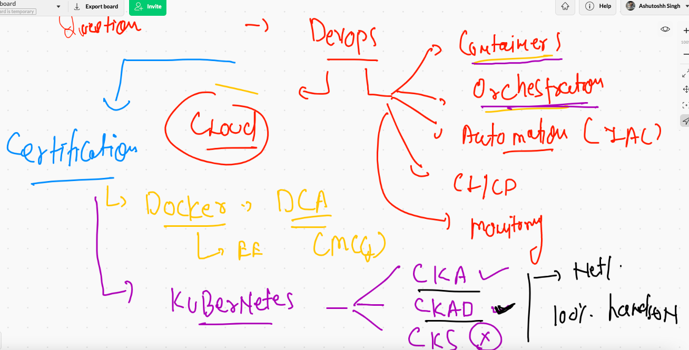
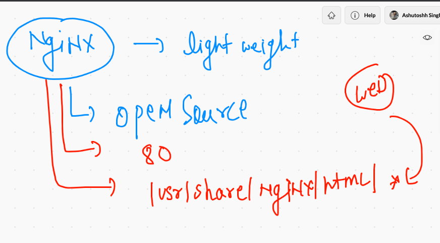
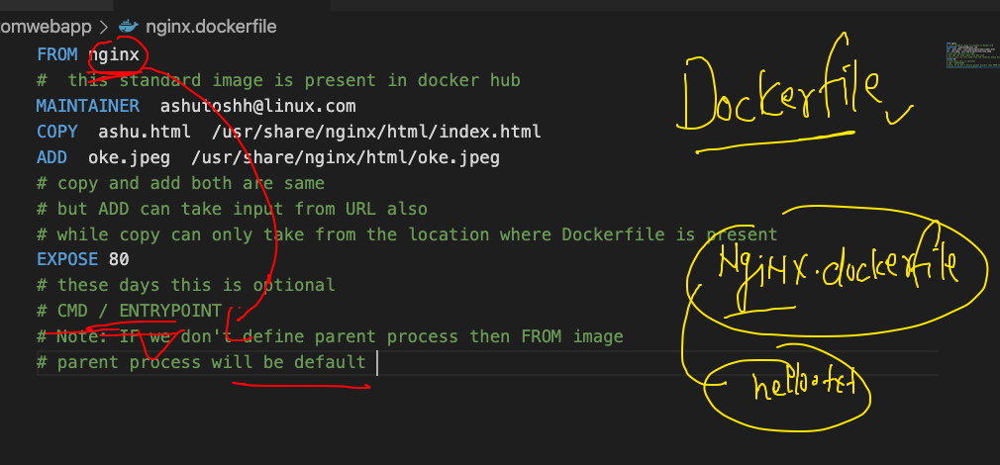
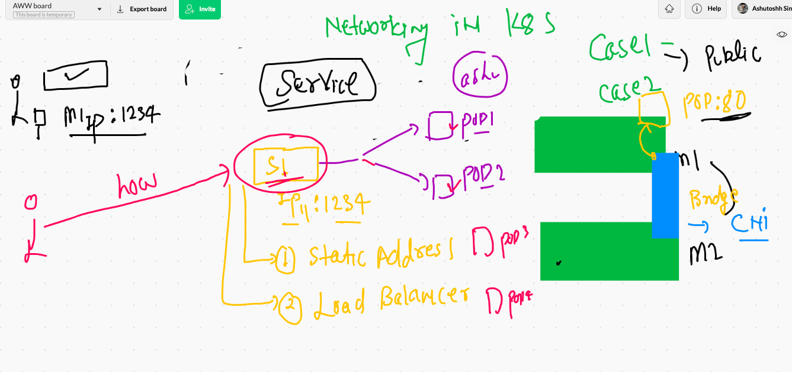
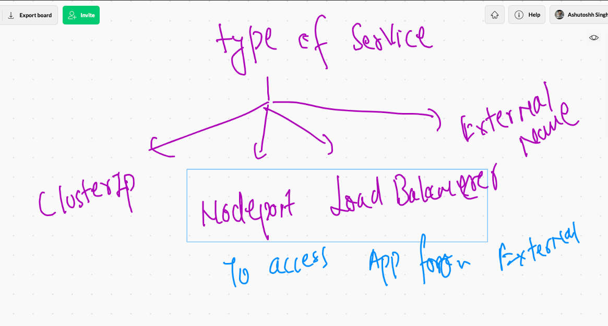
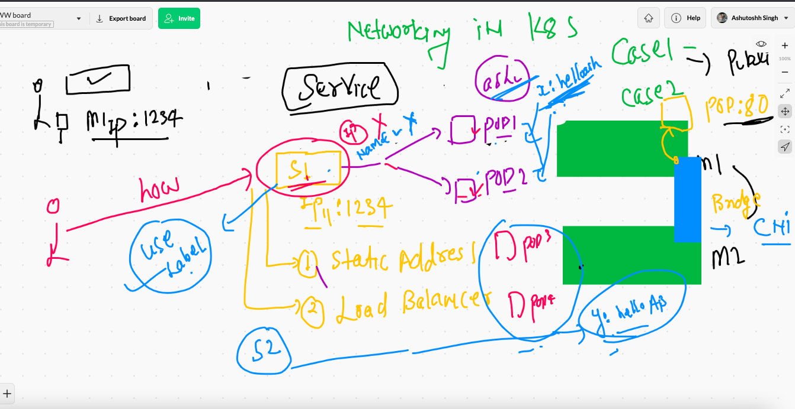
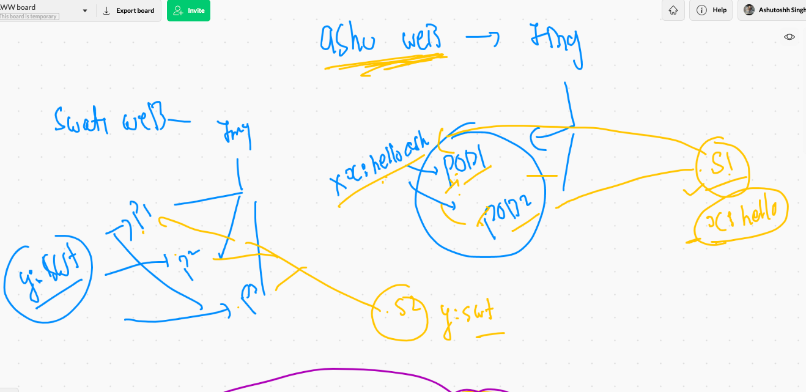

# Docker & k8s certifications 




## Updating context in k8s client side

```
❯ kubectl  config  get-contexts
CURRENT   NAME                          CLUSTER      AUTHINFO           NAMESPACE
          kubernetes-admin@kubernetes   kubernetes   kubernetes-admin   
*         minikube                      minikube     minikube           default
❯ minikube stop
✋  Stopping node "minikube"  ...
🛑  Powering off "minikube" via SSH ...
🛑  1 nodes stopped.
❯ cp -f Desktop/admin.conf  ~/.kube/config
❯ minikube start
😄  minikube v1.20.0 on Darwin 11.2.3
✨  Using the docker driver based on existing profile
👍  Starting control plane node minikube in cluster minikube
🚜  Pulling base image ...
🔄  Restarting existing docker container for "minikube" ...
🐳  Preparing Kubernetes v1.20.2 on Docker 20.10.6 ...
🔎  Verifying Kubernetes components...
    ▪ Using image gcr.io/k8s-minikube/storage-provisioner:v5
🌟  Enabled addons: storage-provisioner, default-storageclass
🏄  Done! kubectl is now configured to use "minikube" cluster and "default" namespace by default
❯ kubectl  config  get-contexts
CURRENT   NAME                          CLUSTER      AUTHINFO           NAMESPACE
          kubernetes-admin@kubernetes   kubernetes   kubernetes-admin   
*         minikube                      minikube     minikube           default


```

## How to switch context in k8s

```
❯ kubectl  config get-contexts
CURRENT   NAME                          CLUSTER      AUTHINFO           NAMESPACE
          kubernetes-admin@kubernetes   kubernetes   kubernetes-admin   
*         minikube                      minikube     minikube           default
❯ 
❯ kubectl   get  nodes
NAME       STATUS   ROLES                  AGE   VERSION
minikube   Ready    control-plane,master   16h   v1.20.2
❯ 
❯ kubectl  config   use-context   kubernetes-admin@kubernetes
Switched to context "kubernetes-admin@kubernetes".
❯ kubectl  config get-contexts
CURRENT   NAME                          CLUSTER      AUTHINFO           NAMESPACE
*         kubernetes-admin@kubernetes   kubernetes   kubernetes-admin   
          minikube                      minikube     minikube           default
❯ kubectl   get  nodes
NAME          STATUS   ROLES                  AGE   VERSION
master-node   Ready    control-plane,master   20h   v1.21.1
minion1       Ready    <none>                 20h   v1.21.1
minion2       Ready    <none>                 20h   v1.21.1

```

### Deleting pods 

```
❯ kubectl  delete pods  jazzpod-1
pod "jazzpod-1" deleted
❯ kubectl  delete pods  --all
pod "mahi-1" deleted
pod "mypod1" deleted
pod "sandip-1" deleted
pod "srini-1" deleted
pod "yogipod" deleted

```

## Creating sample webapp with nginx web container 



### creating dockerfile 



### building image

```
 docker  build  -t   dockerashu/ashunginx:v1 -f nginx.dockerfile   .
Sending build context to Docker daemon   42.5kB
Step 1/5 : FROM nginx
 ---> f0b8a9a54136
Step 2/5 : MAINTAINER  ashutoshh@linux.com
 ---> Running in 63282f9b5660
Removing intermediate container 63282f9b5660
 ---> 7e24c4011d5d
Step 3/5 : COPY  ashu.html  /usr/share/nginx/html/index.html
 ---> a80ef4c4e5c4
Step 4/5 : ADD  oke.jpeg  /usr/share/nginx/html/oke.jpeg
 ---> 587d48d24905
Step 5/5 : EXPOSE 80
 ---> Running in 520bfc2382b4
Removing intermediate container 520bfc2382b4
 ---> 3a18844d6b99
Successfully built 3a18844d6b99
Successfully tagged dockerashu/ashunginx:v1

```

### push image 

```
 docker push dockerashu/ashunginx:v1
The push refers to repository [docker.io/dockerashu/ashunginx]
db0e400b51b9: Pushed 
1ada9d18f412: Pushed 
f0f30197ccf9: Mounted from dockerabhinav47/abhinav 
eeb14ff930d4: Mounted from dockerabhinav47/abhinav 
c9732df61184: Mounted from dockerabhinav47/abhinav 
4b8db2d7f35a: Mounted from dockerabhinav47/abhinav 
431f409d4c5a: Mounted from dockerabhinav47/abhinav 
02c055ef67f5: Mounted from dockerabhinav47/abhinav 
v1: digest: sha256:a47c831e60b06b14a81d80552134c81245ef2e7f86920a0bf00f8daa4bb4f777 size: 1986

```

### automatically  generating yaml / json for pod

```
10049  kubectl  run   ashupod111  --image=dockerashu/ashunginx:v1 --port 80  --dry-run=client 
10050  kubectl  run   ashupod111  --image=dockerashu/ashunginx:v1 --port 80  --dry-run=client -o yaml
10051  kubectl  run   ashupod111  --image=dockerashu/ashunginx:v1 --port 80  --dry-run=client -o json 

```

### saving file yaml and deploying to k8s cluster 

```
❯ kubectl  run   ashupod111  --image=dockerashu/ashunginx:v1 --port 80  --dry-run=client -o yaml   >nginxpod.yaml
❯ ls
nginxpod.yaml
❯ ls
nginxpod.yaml
❯ kubectl apply -f  nginxpod.yaml
pod/ashupod111 created
❯ kubectl  get   po
NAME          READY   STATUS    RESTARTS   AGE
abhinavpod2   1/1     Running   0          12s
ashupod111    1/1     Running   0          6s
❯ kubectl  get   po  -o wide
NAME          READY   STATUS    RESTARTS   AGE   IP              NODE      NOMINATED NODE   READINESS GATES
abhinavpod2   1/1     Running   0          16s   192.168.34.12   minion1   <none>           <none>
ashupod111    1/1     Running   0          10s   192.168.34.13   minion1   <none>           <none>

```

## Networking with service concept in k8s



### type of services 



### understanding svc to pod connection 



### understanding label concept




