## Docker day 1 revision 


### COntainer reality 

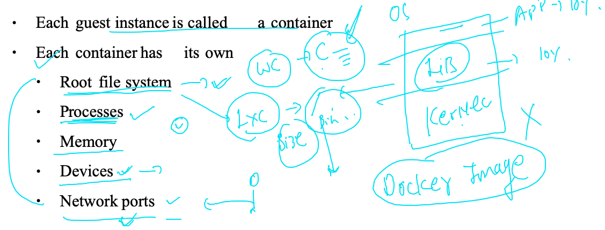


### more closure look to container 

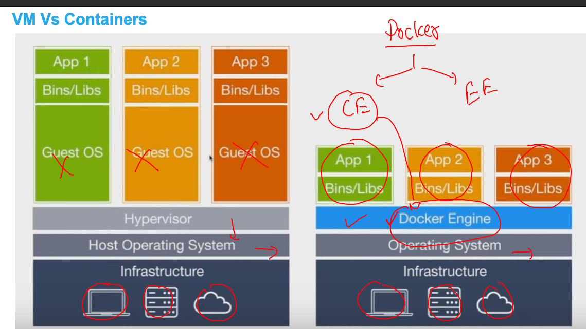

###  Docker components 

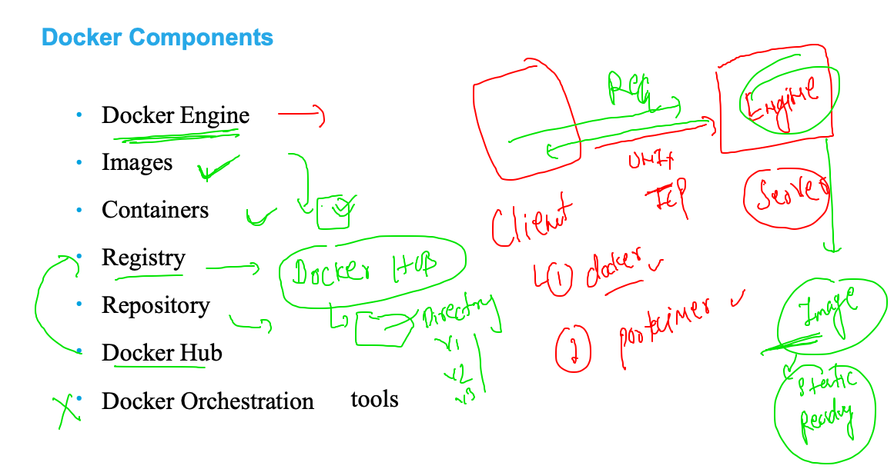


## web application. containerization 

### web server understanding 

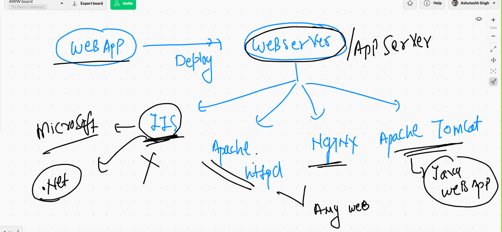

### apache HTTPD 

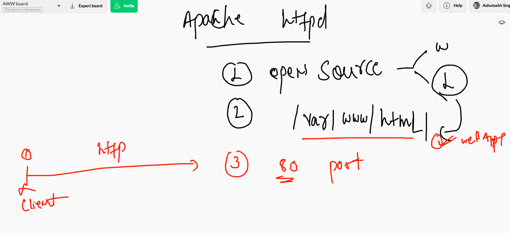

### Webapp -- containrization 

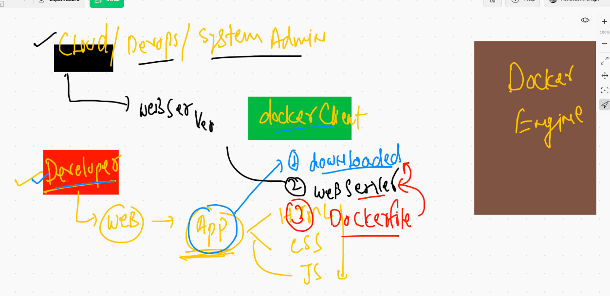

### Trick to remove containers and images (ALL)

```
10176  docker  rm  $(docker ps -aq) 
10177  docker rmi $(docker images -q) -f

```

### Bulding docker images  for webapp 

```
❯ ls
CODE_OF_CONDUCT.md LICENSE            images             styles
Dockerfile         README.md          index.html
❯ 
❯ docker  build   -t    ashuhttpd:18thmay2021v1  .
Sending build context to Docker daemon  63.49kB
Step 1/5 : FROM oraclelinux:8.3
 ---> 816d99f0bbe8
Step 2/5 : MAINTAINER ashutoshh@linux.com
 ---> Running in 460df8aa26c6
Removing intermediate container 460df8aa26c6
 ---> b760a59e74d3
Step 3/5 : RUN  dnf  install  httpd -y
 ---> Running in 790df0be43c8
Oracle Linux 8 BaseOS Latest (x86_64)            66 MB/s |  32 MB     00:00    
Oracle Linux 8 Application Stream (x86_64)       15 MB/s |  24 MB     00:01    
Last metadata expiration check: 0:00:41 ago on Tue May 18 05:28:00 2021.


```

### checking image build history 

```
❯ docker  history  ashuhttpd:18thmay2021v1
IMAGE          CREATED         CREATED BY                                      SIZE      COMMENT
f152b301212a   3 minutes ago   /bin/sh -c #(nop)  CMD ["httpd" "-DFOREGROUN…   0B        
02b90ab78f62   3 minutes ago   /bin/sh -c #(nop) COPY dir:a10de42d8e22bf749…   57.1kB    
f4402e750aae   3 minutes ago   /bin/sh -c dnf  install  httpd -y               128MB     
b760a59e74d3   6 minutes ago   /bin/sh -c #(nop)  MAINTAINER ashutoshh@linu…   0B        
816d99f0bbe8   4 weeks ago     /bin/sh -c #(nop)  CMD ["/bin/bash"]            0B        
<missing>      4 weeks ago     /bin/sh -c #(nop) ADD file:8d6d5e7607cbe7af8…   224MB    

```

### dumping internal infor about docker images

```
❯ docker   inspect  ashuhttpd:18thmay2021v1
[
    {
        "Id": "sha256:f152b301212ab8a83053052bb8662829258371b7ba78ed531ce7aa9fa38d8572",
        "RepoTags": [
            "ashuhttpd:18thmay2021v1"
        ],
        "RepoDigests": [],
        "Parent": "sha256:02b90ab78f620161d062b5f55abf2ce44fc79f970d4500b751eb08ba53687403",
        "Comment": "",
        "Created": "2021-05-18T05:30:34.292751719Z",
        "Container": "7f4a3a148fd5212af1f1732b19f17f46c7015edcaeba112a7ce29a9f17e221bf",
        "ContainerConfig": {
            "Hostname": "7f4a3a148fd5",
            "Domainname": "",
            "User": "",
            "AttachStdin": false,
            "AttachStdout": false,
            "AttachStderr": false,
            "Tty": false,
            "OpenStdin": false,
            "StdinOnce": false,
            "Env": [
                "PATH=/usr/local/sbin:/usr/local/bin:/usr/sbin:/usr/bin:/sbin:/bin"
            ],
            "Cmd": [
```


### filtering out in inspect command 

```
10197  docker   inspect  ashuhttpd:18thmay2021v1   --format='{{.Id}}'
10198  docker   inspect  ashuhttpd:18thmay2021v1   --format='{{.RepoTags}}'
10199  docker   inspect  ashuhttpd:18thmay2021v1   --format='{{.Cmd}}'
10200  docker   inspect  ashuhttpd:18thmay2021v1   --format='{{.ContainerConfig.Cmd}}'


```

###  deploying web application 

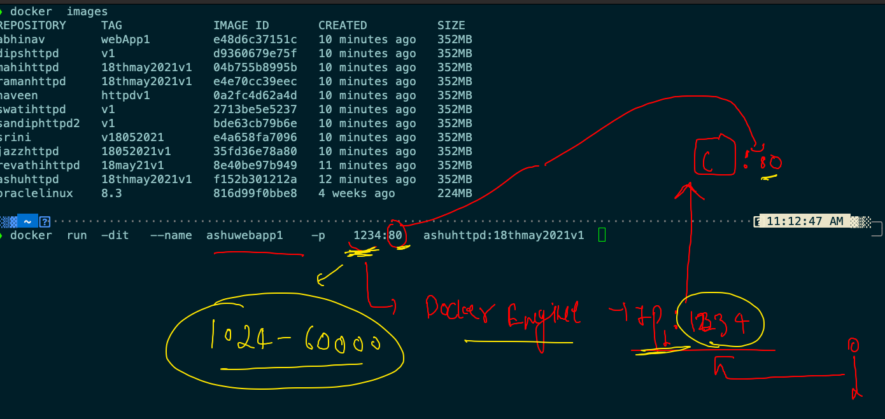


### checking 
```

❯ docker  run  -dit   --name  ashuwebapp1    -p    1234:80   ashuhttpd:18thmay2021v1
e07238006c603a4b7034fbc1d553879d8ce49cdcc4b2220e7a2587744d9934ce
❯ docker  ps
CONTAINER ID   IMAGE                     COMMAND                CREATED              STATUS              PORTS                  NAMES
ff61f527e0f9   dipshttpd:v1              "httpd -DFOREGROUND"   3 seconds ago        Up 1 second         0.0.0.0:4444->80/tcp   dipswebapp1
4da5ecf12dd6   srini:v18052021           "httpd -DFOREGROUND"   5 seconds ago        Up 2 seconds        0.0.0.0:1476->80/tcp   sriniwebapp1
f41eae824afa   sandiphttpd2:v1           "httpd -DFOREGROUND"   5 seconds ago        Up 2 seconds        0.0.0.0:3223->80/tcp   sandipwebapp1
9ba39b8685cd   swatihttpd:v1             "httpd -DFOREGROUND"   5 seconds ago        Up 2 seconds        0.0.0.0:1703->80/tcp   swatiwebapp1
e07238006c60   ashuhttpd:18thmay2021v1   "httpd -DFOREGROUND"   6 seconds ago        Up 4 seconds        0.0.0.0:1234->80/tcp   ashuwebapp1
e83b185a8615   mahihttpd:18thmay2021v1   "httpd -DFOREGROUND"   About a minute ago   Up About a minute   0.0.0.0:1111->80/tcp   mahiwebapp1


```

## Image transfer 

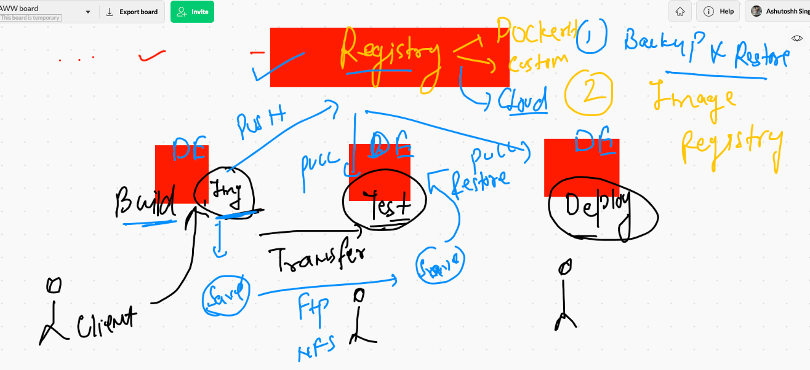

### registry type 

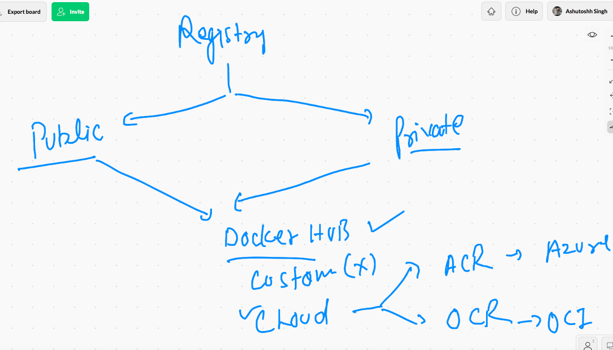

### Docker image name reality 

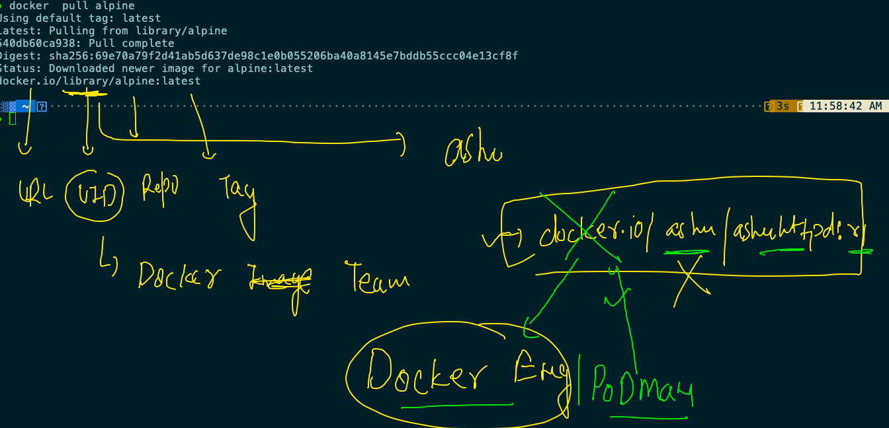

#### more example 

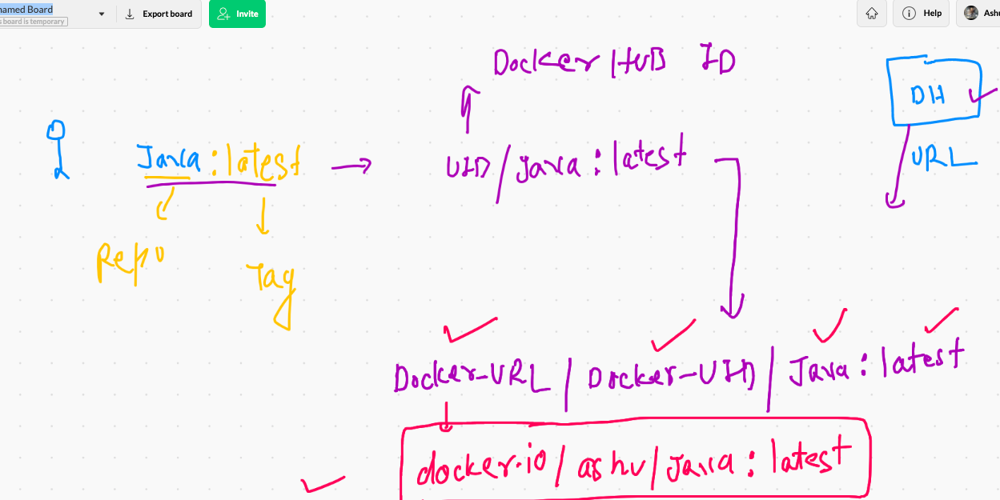

## pushing image to docker hub 

### tag

```
docker   tag  ashuhttpd:18thmay2021v1   dockerashu/ashuhttpd:18thmay2021v1
```

### login 

```
❯ docker  login
Login with your Docker ID to push and pull images from Docker Hub. If you don't have a Docker ID, head over to https://hub.docker.com to create one.
Username: dockerashu
Password: 
Login Succeeded

```

### push 

```

 docker  push dockerashu/ashuhttpd:18thmay2021v1
The push refers to repository [docker.io/dockerashu/ashuhttpd]
c0cf451ba316: Pushed 
7461488bed39: Pushed 
02a3a073ed48: Mounted from library/oraclelinux 
18thmay2021v1: digest: sha256:ea0e3ba4881799c0254f2c9f8eb8ef5b3ad6b1815d52352cd595b5d8c7489c8b size: 950

```

### logout for safety reason

```
 docker  logout
Removing login credentials for https://index.docker.io/v1/

```

## Docker summary sofar 

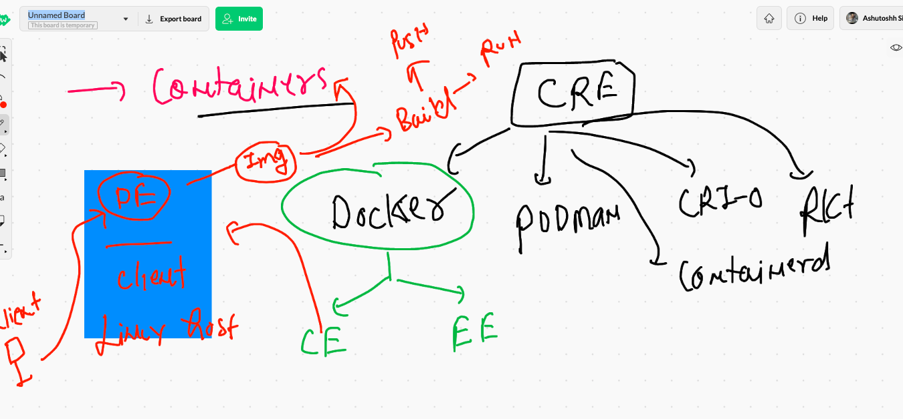

# Docker networking 

## checking docker0 interface 

```
[ec2-user@ip-172-31-71-168 ~]$ ifconfig docker0
docker0: flags=4163<UP,BROADCAST,RUNNING,MULTICAST>  mtu 1500
        inet 172.17.0.1  netmask 255.255.0.0  broadcast 172.17.255.255
        inet6 fe80::42:86ff:fe81:1950  prefixlen 64  scopeid 0x20<link>
        ether 02:42:86:81:19:50  txqueuelen 0  (Ethernet)
        RX packets 41561  bytes 31327285 (29.8 MiB)
        RX errors 0  dropped 0  overruns 0  frame 0
        TX packets 73145  bytes 856663525 (816.9 MiB)
        TX errors 0  dropped 0 overruns 0  carrier 0  collisions 0
        
 ```
 
 
 ### Docker network understanding 
 
 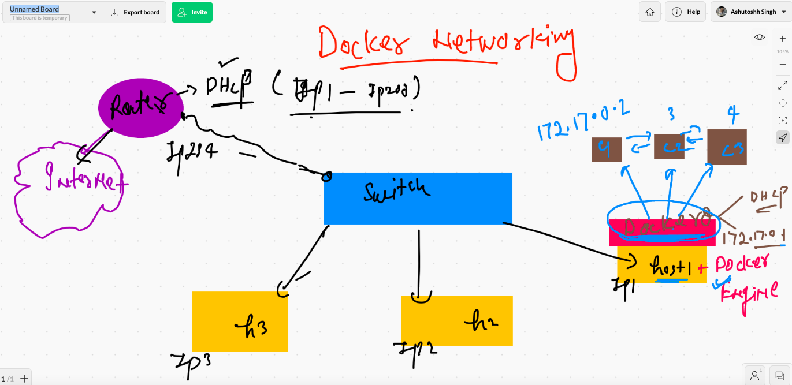
 
 ### checking container IP 
 
 ```
  docker  inspect   ashuwebapp1  --format='{{.NetworkSettings.IPAddress}}'
172.17.0.3


```

### checking ip from inside container as well

```
❯ docker  exec  -it  ashuwebapp1  bash
[root@e07238006c60 /]# 
[root@e07238006c60 /]# ifconfig
bash: ifconfig: command not found
[root@e07238006c60 /]# ip a
1: lo: <LOOPBACK,UP,LOWER_UP> mtu 65536 qdisc noqueue state UNKNOWN group default qlen 1000
    link/loopback 00:00:00:00:00:00 brd 00:00:00:00:00:00
    inet 127.0.0.1/8 scope host lo
       valid_lft forever preferred_lft forever
34: eth0@if35: <BROADCAST,MULTICAST,UP,LOWER_UP> mtu 1500 qdisc noqueue state UP group default 
    link/ether 02:42:ac:11:00:03 brd ff:ff:ff:ff:ff:ff link-netnsid 0
    inet 172.17.0.3/16 brd 172.17.255.255 scope global eth0
       valid_lft forever preferred_lft forever
       
 ```
 
 ### nat in docker 
 
 ```
 ❯ docker  run -itd  --name ashux1  alpine ping google.com
54b3bc88b806349cff1c02da1207535c7426f12c2dc5d4ae857cfb4ffee61d4e
❯ docker  exec -it ashux1 sh
/ # ifconfig 
eth0      Link encap:Ethernet  HWaddr 02:42:AC:11:00:02  
          inet addr:172.17.0.2  Bcast:172.17.255.255  Mask:255.255.0.0
          UP BROADCAST RUNNING MULTICAST  MTU:1500  Metric:1
          RX packets:24 errors:0 dropped:0 overruns:0 frame:0
          TX packets:19 errors:0 dropped:0 overruns:0 carrier:0
          collisions:0 txqueuelen:0 
          RX bytes:2112 (2.0 KiB)  TX bytes:1582 (1.5 KiB)

lo        Link encap:Local Loopback  
          inet addr:127.0.0.1  Mask:255.0.0.0
          UP LOOPBACK RUNNING  MTU:65536  Metric:1
          RX packets:0 errors:0 dropped:0 overruns:0 frame:0
          TX packets:0 errors:0 dropped:0 overruns:0 carrier:0
          collisions:0 txqueuelen:1000 
          RX bytes:0 (0.0 B)  TX bytes:0 (0.0 B)

/ # ping  172.17.0.2
PING 172.17.0.2 (172.17.0.2): 56 data bytes
64 bytes from 172.17.0.2: seq=0 ttl=255 time=0.063 ms
64 bytes from 172.17.0.2: seq=1 ttl=255 time=0.071 ms
^C
--- 172.17.0.2 ping statistics ---
2 packets transmitted, 2 packets received, 0% packet loss
round-trip min/avg/max = 0.063/0.067/0.071 ms
/ # ping  fb.com
PING fb.com (157.240.229.35): 56 data bytes
64 bytes from 157.240.229.35: seq=0 ttl=50 time=0.888 ms
64 bytes from 157.240.229.35: seq=1 ttl=50 time=0.744 ms
64 bytes from 157.240.229.35: seq=2 ttl=50 time=0.741 ms
^C
--- fb.com ping statistics ---
3 packets transmitted, 3 packets received, 0% packet loss
round-trip min/avg/max = 0.741/0.791/0.888 ms
/ # exit

```

## Docker bridges 

### no of bridge 


### checking containers connect with docker0

```
❯ docker  network  inspect  1f69eada5a46
[
    {
        "Name": "bridge",
        "Id": "1f69eada5a46e617b4ff3afb7305c22e25655a672083d05a4905442889f6c6a6",
        "Created": "2021-05-18T04:15:15.844473296Z",
        "Scope": "local",
        "Driver": "bridge",
        "EnableIPv6": false,
        "IPAM": {
            "Driver": "default",
            "Options": null,
            "Config": [
                {
                    "Subnet": "172.17.0.0/16",
                    "Gateway": "172.17.0.1"
                }
            ]
        },
        "Internal": false,
        "Attachable": false,
        "Ingress": false,
        "ConfigFrom": {
            "Network": ""
        },
        "ConfigOnly": false,
        "Containers": {
            "1ba98e11373fa89b5790d365136b66eca98c074f24cf20ed005df085676208e7": {
                "Name": "ashux1",
                "EndpointID": "2243fc1ef09f72541b8023b4368f889221771382ada47570607e184ead89f27f",
                "MacAddress": "02:42:ac:11:00:04",
                "IPv4Address": "172.17.0.4/16",
                "IPv6Address": ""
            },
            "850ee0d298f11b4a9ae0d024dc0a87d939fb50bfac6bce2e81e89d3f25915e6f": {
                "Name": "swativ2",
                "EndpointID": "50e1b60de3f369c47fac68be0d7be1355ce0a284d74463e292680008c67f243c",
                "MacAddress": "02:42:ac:11
                
                
   ```
   
   
### port forwarding 

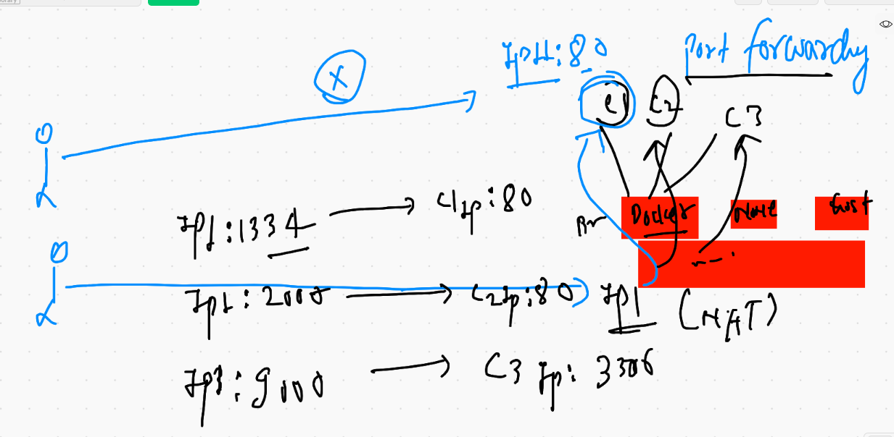


### creating docker network bridge 

```
❯ docker  network  ls
NETWORK ID     NAME      DRIVER    SCOPE
1f69eada5a46   bridge    bridge    local
612ea4c2b4a0   host      host      local
d13a3ba33cce   none      null      local
❯ docker  network  create  ashubr1  --subnet=192.168.100.0/24
d7f8b6554c57b6767b6423ded8927c820370edffaa83308deef15eb16a212a5a
❯ docker  network  ls
NETWORK ID     NAME         DRIVER    SCOPE
8a7e60b11c40   abhinavbr1   bridge    local
d7f8b6554c57   ashubr1      bridge    local
1f69eada5a46   bridge       bridge    local
612ea4c2b4a0   host         host      local
9207425a8456   jazzbr1      bridge    local
d13a3ba33cce   none         null      local
7d5829fd8b99   swatibr1     bridge    local


```

### creating container in my custom bridge 

```
❯ docker  network  ls
NETWORK ID     NAME      DRIVER    SCOPE
1f69eada5a46   bridge    bridge    local
612ea4c2b4a0   host      host      local
d13a3ba33cce   none      null      local
❯ docker  network  create  ashubr1  --subnet=192.168.100.0/24
d7f8b6554c57b6767b6423ded8927c820370edffaa83308deef15eb16a212a5a
❯ docker  network  ls
NETWORK ID     NAME         DRIVER    SCOPE
8a7e60b11c40   abhinavbr1   bridge    local
d7f8b6554c57   ashubr1      bridge    local
1f69eada5a46   bridge       bridge    local
612ea4c2b4a0   host         host      local
9207425a8456   jazzbr1      bridge    local
d13a3ba33cce   none         null      local
7d5829fd8b99   swatibr1     bridge    local

```

### container with static ip 

```
❯ docker  run  -itd --name ashuc2  --network   ashubr1 --ip 192.168.100.50   alpine ping fb.com
b749010bee495e3f93adfaa70ac60613ccf486cee173294638ca09d047804a58
❯ docker  network  inspect  ashubr1
[
    {
        "Name": "ashubr1",
        "Id": "d7f8b6554c57b6767b6423ded8927c820370edffaa83308deef15eb16a212a5a",
        "Created": "2021-05-18T09:32:53.162285365Z",
        "Scope": "local",
        "Driver": "bridge",
        "EnableIPv6": false,
        "IPAM": {
            "Driver": "default",
            "Options": {},
            "Config": [
                {
                    "Subnet": "192.168.100.0/24"
                }
            ]
        },
        "Internal": false,
        "Attachable": false,
        "Ingress": false,
        "ConfigFrom": {
            "Network": ""
        },
        "ConfigOnly": false,
        "Containers": {
            "66fbcfffcd633b50eb04fca8bb667a7226a16b0267fe5b7bea73c1c982e6f5d9": {
                "Name": "ashuc1",
                "EndpointID": "358b195d893af1ea9cc1a049757cfb7e75a9e86afec53751a9bde052462747ce",
                "MacAddress": "02:42:c0:a8:64:02",
                "IPv4Address": "192.168.100.2/24",
                "IPv6Address": ""
            },
            "b749010bee495e3f93adfaa70ac60613ccf486cee173294638ca09d047804a58": {
                "Name": "ashuc2",
                "EndpointID": "9d2d09d4b629afa7e3c5bd086a7ccb5588ecb85fb9b5e43be7fbec2299d19b53",
                "MacAddress": "02:42:c0:a8:64:32",
                "IPv4Address": "192.168.100.50/24",
                "IPv6Address": ""

```

### checking connection 

```
❯ docker  exec  -it  ashuc1  sh
/ # ping 192.168.100.50
PING 192.168.100.50 (192.168.100.50): 56 data bytes
64 bytes from 192.168.100.50: seq=0 ttl=255 time=0.145 ms
64 bytes from 192.168.100.50: seq=1 ttl=255 time=0.111 ms
^C
--- 192.168.100.50 ping statistics ---
2 packets transmitted, 2 packets received, 0% packet loss
round-trip min/avg/max = 0.111/0.128/0.145 ms
/ # 
/ # 
/ # ping ashuc2
PING ashuc2 (192.168.100.50): 56 data bytes
64 bytes from 192.168.100.50: seq=0 ttl=255 time=0.141 ms
64 bytes from 192.168.100.50: seq=1 ttl=255 time=0.118 ms
64 bytes from 192.168.100.50: seq=2 ttl=255 time=0.121 ms
^C
--- ashuc2 ping statistics ---
3 packets transmitted, 3 packets received, 0% packet loss
round-trip min/avg/max = 0.118/0.126/0.141 ms
/ # exit

```

### remove bridge

```
❯ docker  network  rm   ashubr1
Error response from daemon: error while removing network: network ashubr1 id d7f8b6554c57b6767b6423ded8927c820370edffaa83308deef15eb16a212a5a has active endpoints

```

### removeing all bridge with no use

```
❯ docker  network  prune
WARNING! This will remove all custom networks not used by at least one container.
Are you sure you want to continue? [y/N] y
Deleted Networks:
dipsbrdge
naveenbr1
ashubr1
srinbridge
revathibr1
swatibr1
sandip1
mahinet
yogbridge

❯ docker  network  ls
NETWORK ID     NAME      DRIVER    SCOPE
1f69eada5a46   bridge    bridge    local
612ea4c2b4a0   host      host      local
d13a3ba33cce   none      null      local


```

### Question 1

```
Q1.   create  two containers and do the given things  

Image must be alpine 
Name of container <yourname>c1 & <yourname>c2
Parent process you can choose accordingly 
Create two files in container1 named aa.txt & bb.txt 
Now copy aa.txt into second container
Under you custom bridge complete above task 


```

## assignment 1 solution 

```
❯ docker  network  create  ashubr1  --subnet=192.168.200.0/24
3cc1ec68531002f63d74f1f12f566e8ee4e04cacd7b41581adf5a08434345e2d
❯ docker run -itd --name ashuc11  --network ashubr1  alpine ping fb.com
8f2f036b49bb8c9dc7bf773f6cd173f724047d8303ae0b05ab14e0e3a7c59b10
❯ docker run -itd --name ashuc12  --network ashubr1  alpine ping fb.com
a4b70bc3668eacecdf560a2b27afe3d27b09e7daff762b0fd07eb3ec04c031b5
❯ docker  exec -it ashuc11 sh
/ # pwd
/
/ # ls
bin    dev    etc    home   lib    media  mnt    opt    proc   root   run    sbin   srv    sys    tmp    usr    var
/ # echo  hello  >aa.txt 
/ # ls
aa.txt  dev     home    media   opt     root    sbin    sys     usr
bin     etc     lib     mnt     proc    run     srv     tmp     var
/ # echo world  >bb.txt 
/ # ls
aa.txt  bin     etc     lib     mnt     proc    run     srv     tmp     var
bb.txt  dev     home    media   opt     root    sbin    sys     usr
/ # exit
❯ docker  cp   ashuc11:/aa.txt  .
❯ ls
Applications          Documents             Movies                Public                awscli-bundle         k8susers
Creative Cloud Files  Downloads             Music                 VirtualBox VMs        go                    macos-terminal-themes
Desktop               Library               Pictures              aa.txt                javawebapp            powerlevel10k
❯ cat  aa.txt
hello
❯ docker  cp aa.txt  ashuc12:/
❯ docker  exec -it ashuc12 sh
/ # ls
aa.txt  dev     home    media   opt     root    sbin    sys     usr
bin     etc     lib     mnt     proc    run     srv     tmp     var
/ # cat aa.txt 
hello
/ # 

```


# Storage in Docker 

### attaching external storage to host 

```
[root@ip-172-31-71-168 ~]# 
[root@ip-172-31-71-168 ~]# lsblk 
NAME          MAJ:MIN RM  SIZE RO TYPE MOUNTPOINT
nvme0n1       259:0    0  100G  0 disk 
|-nvme0n1p1   259:1    0  100G  0 part /
`-nvme0n1p128 259:2    0    1M  0 part 
[root@ip-172-31-71-168 ~]# lsblk 
NAME          MAJ:MIN RM  SIZE RO TYPE MOUNTPOINT
nvme0n1       259:0    0  100G  0 disk 
|-nvme0n1p1   259:1    0  100G  0 part /
`-nvme0n1p128 259:2    0    1M  0 part 
nvme1n1       259:3    0  200G  0 disk 
[root@ip-172-31-71-168 ~]# 
[root@ip-172-31-71-168 ~]# mkfs.xfs  -i size=512  /dev/nvme1n1
meta-data=/dev/nvme1n1           isize=512    agcount=4, agsize=13107200 blks
         =                       sectsz=512   attr=2, projid32bit=1
         =                       crc=1        finobt=1, sparse=0
data     =                       bsize=4096   blocks=52428800, imaxpct=25
         =                       sunit=0      swidth=0 blks
naming   =version 2              bsize=4096   ascii-ci=0 ftype=1
log      =internal log           bsize=4096   blocks=25600, version=2
         =                       sectsz=512   sunit=0 blks, lazy-count=1
realtime =none                   extsz=4096   blocks=0, rtextents=0
[root@ip-172-31-71-168 ~]# mkdir  /mnt/data
[root@ip-172-31-71-168 ~]# mount  /dev/nvme1n1  /mnt/data/

```

### configue docker engine 

```
[root@ip-172-31-71-168 ~]# cd  /etc/sysconfig/
[root@ip-172-31-71-168 sysconfig]# ls
acpid       clock     docker          init        modules          nfs            rpc-rquotad  run-parts  sysstat.ioconf
atd         console   docker-storage  irqbalance  netconsole       raid-check     rpcbind      selinux
authconfig  cpupower  grub            keyboard    network          rdisc          rsyncd       sshd
chronyd     crond     i18n            man-db      network-scripts  readonly-root  rsyslog      sysstat
[root@ip-172-31-71-168 sysconfig]# cat  docker
# The max number of open files for the daemon itself, and all
# running containers.  The default value of 1048576 mirrors the value
# used by the systemd service unit.
DAEMON_MAXFILES=1048576

# Additional startup options for the Docker daemon, for example:
# OPTIONS="--ip-forward=true --iptables=true"
# By default we limit the number of open files per container
OPTIONS="--default-ulimit nofile=1024:4096 -H tcp://0.0.0.0:2375 -g  /mnt/data"

# How many seconds the sysvinit script waits for the pidfile to appear
# when starting the daemon.
DAEMON_PIDFILE_TIMEOUT=10


```

### Docker  volume. for. container storgae 


###  container ephemral nature 

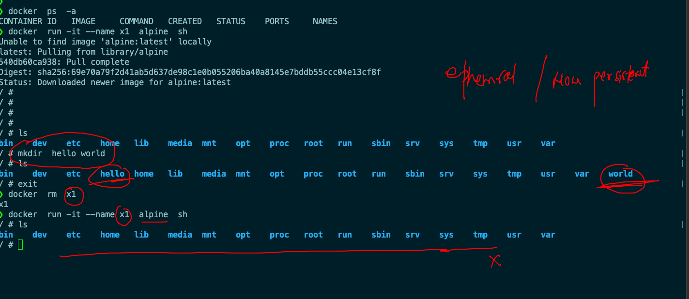

### creating volume 

```
❯ docker   volume  create  ashuvol1
ashuvol1
❯ docker   volume  ls
DRIVER    VOLUME NAME
local     ashuvol1


```
### creating a temp container 

```
❯ docker  run -it  --rm   --name ashucc1  -v   ashuvol1:/store:rw   alpine  sh
/ # 
/ # 
/ # cd  /store/
/store # ls
/store # mkdir  hello world  this is docker  volume  
/store # ls
docker  hello   is      this    volume  world
/store # 


```

### sharing data with diff cont

```
❯ docker  run -it --name x1111 -v  ashuvol1:/mnt/do:ro    oraclelinux:8.3  bash
[root@da80cc26d314 /]# 
[root@da80cc26d314 /]# 
[root@da80cc26d314 /]# 
[root@da80cc26d314 /]# cd  /mnt/do/
[root@da80cc26d314 do]# ls
docker  hello  is  this  volume  world
[root@da80cc26d314 do]# mkdir  hii
mkdir: cannot create directory 'hii': Read-only file system
[root@da80cc26d314 do]# 


```

## volume history 

```
0302  docker   volume  create  ashuvol1
10303  docker   volume  ls
10304  docker   volume  inspect  swativol1
10305  docker   volume  ls
10306  docker  run -it  --rm   --name ashucc1  -v   ashuvol1:/store:rw   alpine  sh 
10307  docker  start  ashucc1
10308  docker  ps 
10309  docker  rm ashucc1  -f
10310  docker  volume  ls
10311  docker  run -it  --rm   --name ashucc1  -v   ashuvol1:/store:rw   alpine  sh 
10312  docker  run -it  --rm   --name ashucc11  -v   ashuvol1:/store:rw   alpine  sh 
10313  history
10314  docker  run -it --name x1 -v  ashuvol1:/mnt/do:ro    oraclelinux:8.3  bash 
10315  docker  run -it --name x1111 -v  ashuvol1:/mnt/do:ro    oraclelinux:8.3  bash 

```


