# docker tips

## On docker host 

### non root user can't use docker cli so to do that 

```
 usermod -aG docker  ec2-user
```

### here ec2-user is a non root user 

# VOlume 


## creating volume 

```
❯ docker  volume  ls
DRIVER    VOLUME NAME
❯ docker  volume  create  ashuvol1
ashuvol1
❯ docker  volume  ls
DRIVER    VOLUME NAME
local     ashuvol1
❯ docker  volume  inspect  ashuvol1
[
    {
        "CreatedAt": "2021-05-19T04:38:24Z",
        "Driver": "local",
        "Labels": {},
        "Mountpoint": "/var/lib/docker/volumes/ashuvol1/_data",
        "Name": "ashuvol1",
        "Options": {},
        "Scope": "local"
    }
]

```

## Mounting a particular directory into container 

```
 docker  run   -it --rm  -v  /etc:/myhostetc:ro   ubuntu   bash
Unable to find image 'ubuntu:latest' locally
latest: Pulling from library/ubuntu
345e3491a907: Pull complete 
57671312ef6f: Pull complete 
5e9250ddb7d0: Pull complete 
Digest: sha256:cf31af331f38d1d7158470e095b132acd126a7180a54f263d386da88eb681d93
Status: Downloaded newer image for ubuntu:latest
root@a673c5f1c70a:/# 
root@a673c5f1c70a:/# 
root@a673c5f1c70a:/# cat  /etc/os-release 
NAME="Ubuntu"
VERSION="20.04.2 LTS (Focal Fossa)"
ID=ubuntu
ID_LIKE=debian
PRETTY_NAME="Ubuntu 20.04.2 LTS"
VERSION_ID="20.04"
HOME_URL="https://www.ubuntu.com/"
SUPPORT_URL="https://help.ubuntu.com/"
BUG_REPORT_URL="https://bugs.launchpad.net/ubuntu/"
PRIVACY_POLICY_URL="https://www.ubuntu.com/legal/terms-and-policies/privacy-policy"
VERSION_CODENAME=focal
UBUNTU_CODENAME=focal
root@a673c5f1c70a:/# ls
bin   dev  home  lib32  libx32  mnt        opt   root  sbin  sys  usr
boot  etc  lib   lib64  media   myhostetc  proc  run   srv   tmp  var
root@a673c5f1c70a:/# cd  myhostetc/
root@a673c5f1c70a:/myhostetc# ls
DIR_COLORS               cron.monthly         hibinit-config.cfg  mke2fs.conf        protocols         shells
DIR_COLORS.256color      cron.weekly          host.conf           modprobe.d         python            skel
DIR_COLORS.lightbgcolor  crontab              hostname            modules-load.d     rc.d              ssh
GREP_COLORS              csh.cshrc            hosts               motd               rc.local          ssl
GeoIP.conf               csh.login            hosts.allow         mtab               rc0.d             statetab
GeoIP.conf.default       dbus-1               hosts.deny          my.cnf             rc1.d             statetab.d
NetworkManager           default              idmapd.conf         my.cnf.d           rc2.d             subgid
X11                      depmod.d             image-id            nanorc             rc3.d             subuid
acpi                     dhcp                 init.d              netconfig          rc4.d             sudo-ldap.conf
adjtime                  docker               inittab             networks           rc5.d             sudo.conf
aliases                  docker-runtimes.d    inputrc             nfs.conf           rc6.d             sudoers
aliases.db               dracut.conf          iproute2            nfsmount.conf      request-key.conf  sudoers.d
alternatives             dracut.conf.d        issu

```

### 

```
❯ docker  run   -it --rm  -v  /etc:/myhostetc:ro  -v  ashuvol1:/okvol:rw   ubuntu   bash
root@b0f55516d588:/# ls
bin   dev  home  lib32  libx32  mnt        okvol  proc  run   srv  tmp  var
boot  etc  lib   lib64  media   myhostetc  opt    root  sbin  sys  usr
```


### more examples 

```
5  docker  run   -it --rm  -v  /etc:/myhostetc:ro   ubuntu   bash 
10016  history
10017  docker  run   -it --rm  -v  /etc:/myhostetc:ro  -v  ashuvol1:/okvol:rw   ubuntu   bash 
10018  history
10019  docker  run -itd --name any  -p 9000:9000  -v  /var/run/docker.sock:/var/run/docker.sock  portainer/portainer

```

## App deployment issues with containers

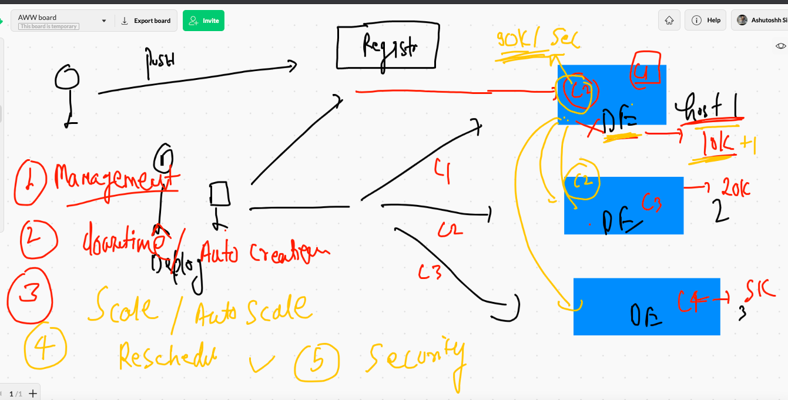


# Orchestration engine 

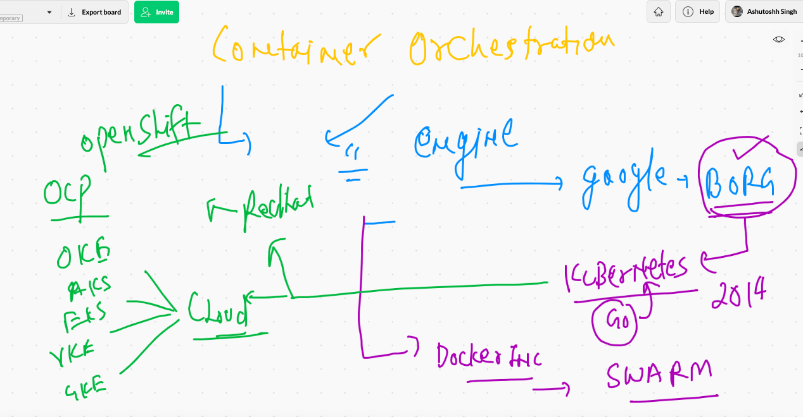

## K8s arch 1 

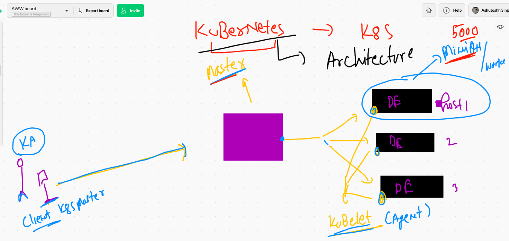

## Minion understanding 

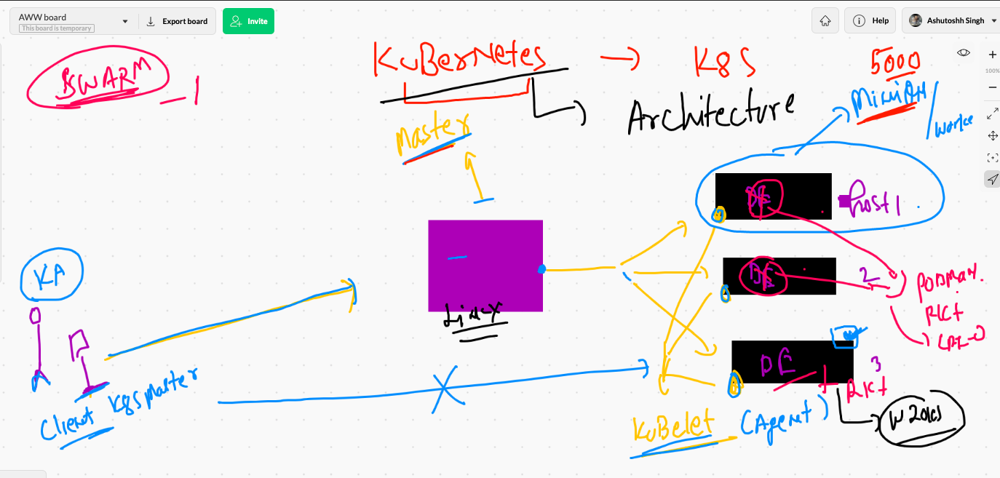


## Kube-apiserver

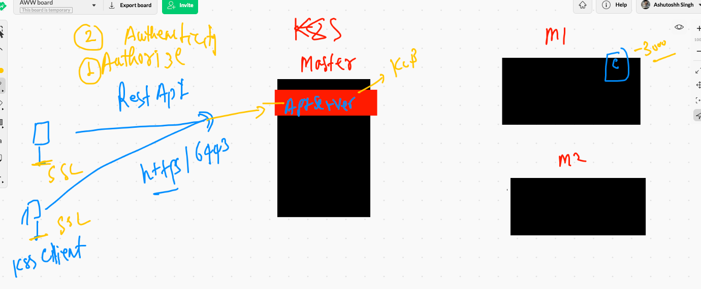

## kube-schedular 

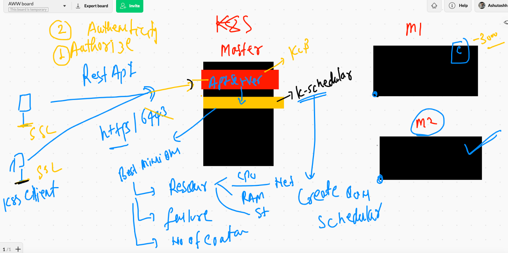

### kube-controller-manager reality 

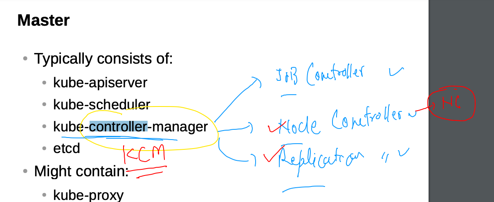

### Node-controller 

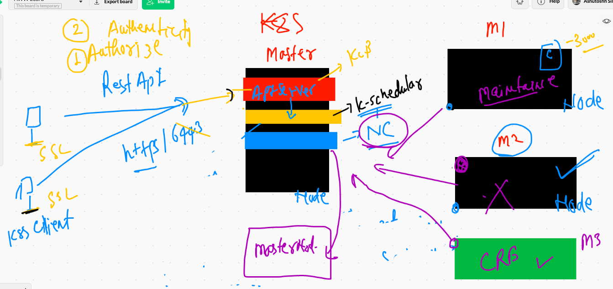

### Replication-controller 

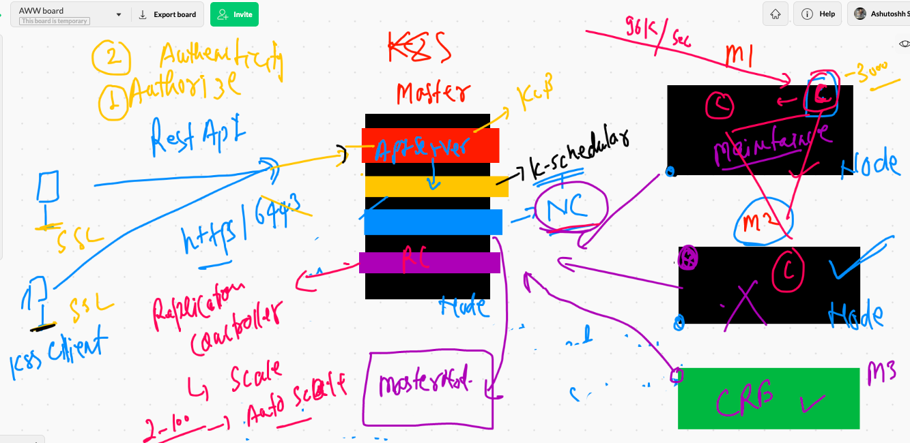

### etcd the brain of k8s

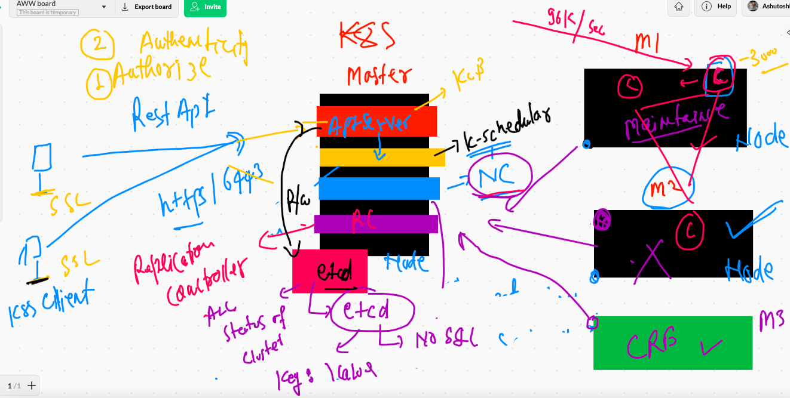

### CNI 


### CNI bridge on minion side

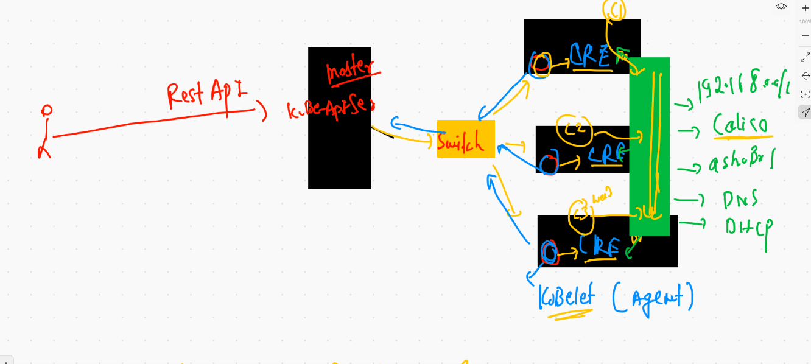


### kube-proxy -- to maintain communication b/w container across minion node

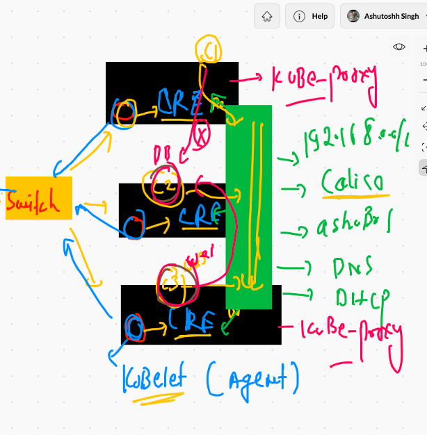


