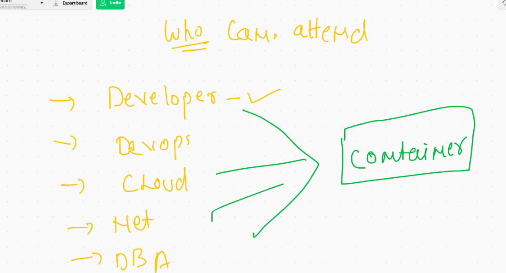
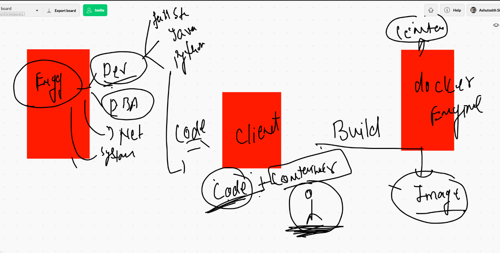

## Getting started with Docker -- the container platform.

## who can attend



### app deployment problems in past


### solution by Hypervisor 


### limitations with Hypervisor technology 


## Solution to above discussed problem is COntainers 


# INtroduction to containers 


## Container finally 


## Docker info 


## Installation info 


## Docker Desktop info 


## Docker desktop download link 

### FOR MAC 

[docker desktop](https://hub.docker.com/editions/community/docker-ce-desktop-mac)

### WIndows 10 

[Docker Desktop](https://docs.docker.com/docker-for-windows/install/)


# Docker architecture 

##  CLient side 


## Installing Docker on LInux (OL|RHEL)

```
[root@ip-172-31-71-168 ~]# yum  install docker  -y
Failed to set locale, defaulting to C
Loaded plugins: extras_suggestions, langpacks, priorities, update-motd
amzn2-core                                                                                               | 3.7 kB  00:00:00     
Resolving Dependencies
--> Running transaction check
---> Package docker.x86_64 0:20.10.4-1.amzn2 will be installed
--> Processing Dependency: runc >= 1.0.0 for package: docker-20.10.4-1.amzn2.x86_64
--> Processing Dependency: libcgroup >= 0.40.rc1-5.15 for package: docker-20.10.4-1.amzn2.x86_64
--> Processing Dependency: containerd >= 1.3.2 for package: docker-20.10.4-1.amzn2.x86_64
--> Processing Dependency: pigz for package: docker-20.10.4-1.amzn2.x86_64
--> Running transaction check
---> Package containerd.x86_64 0:1.4.4-1.amzn2 will be installed
---> Package libcgroup.x86_64 0:0.41-21.amzn2 will be installed
---> Package pigz.x86_64 0:2.3.4-1.am

```

## COnfigure docker engine to accept remote connection 


```
[root@ip-172-31-71-168 ~]# cd  /etc/sysconfig/
[root@ip-172-31-71-168 sysconfig]# ls
acpid       clock     docker          init        modules          nfs            rpc-rquotad  run-parts  sysstat.ioconf
atd         console   docker-storage  irqbalance  netconsole       raid-check     rpcbind      selinux
authconfig  cpupower  grub            keyboard    network          rdisc          rsyncd       sshd
chronyd     crond     i18n            man-db      network-scripts  readonly-root  rsyslog      sysstat
[root@ip-172-31-71-168 sysconfig]# vim docker
[root@ip-172-31-71-168 sysconfig]# cat  docker
# The max number of open files for the daemon itself, and all
# running containers.  The default value of 1048576 mirrors the value
# used by the systemd service unit.
DAEMON_MAXFILES=1048576

# Additional startup options for the Docker daemon, for example:
# OPTIONS="--ip-forward=true --iptables=true"
# By default we limit the number of open files per container
OPTIONS="--default-ulimit nofile=1024:4096 -H tcp://0.0.0.0:2375"

# How many seconds the sysvinit script waits for the pidfile to appear
# when starting the daemon.
DAEMON_PIDFILE_TIMEOUT=10

```

### starting docker engine 

```
[root@ip-172-31-71-168 sysconfig]# systemctl start  docker 
[root@ip-172-31-71-168 sysconfig]# systemctl status  docker 
● docker.service - Docker Application Container Engine
   Loaded: loaded (/usr/lib/systemd/system/docker.service; disabled; vendor preset: disabled)
   Active: active (running) since Mon 2021-05-17 06:32:14 UTC; 6s ago
     Docs: https://docs.docker.com
  Process: 32384 ExecStartPre=/usr/libexec/docker/docker-setup-runtimes.sh (code=exited, status=0/SUCCESS)
  Process: 32371 ExecStartPre=/bin/mkdir -p /run/docker (code=exited, status=0/SUCCESS)
 Main PID: 32396 (dockerd)
    Tasks: 8
   Memory: 40.7M
   CGroup: /system.slice/docker.service
           └─32396 /usr/bin/dockerd -H fd:// --containerd=/run/containerd/containerd.sock --default-ulimit nofile=1024:4096 -...

May 17 06:32:13 ip-172-31-71-168.ec2.internal dockerd[32396]: time="2021-05-17T06:32:13.814852270Z" level=info msg="ccRes...grpc
May 17 06:32:13 ip-172-31-71-168.ec2.internal dockerd[32396]: time="2021-05-17T06:32:13.814872164Z" level=info msg="Clien...grpc
May 17 06:32:13 ip-172-31-71-168.ec2.internal dockerd[32396]: time="2021-05-17T06:32:13.866195018Z" level=info msg="Loadi...rt."
May 17 06:32:14 ip-172-31-71-168.ec2.internal dockerd[32396]: time="2021-05-17T06:32:14.250145309Z" level=info msg="Defau...ess"
May 17 06:32:14 ip-172-31-71-168.ec2.internal dockerd[32396]: time="2021-05-17T06:32:14.469196704Z" level=info msg="Loadi...ne."
May 17 06:32:14 ip-172-31-71-168.ec2.internal dockerd[32396]: time="2021-05-17T06:32:14.504259952Z" level=info msg="Docke...10.4
May 17 06:32:14 ip-172-31-71-168.ec2.internal dockerd[32396]: time="2021-05-17T06:32:14.504390198Z" level=info msg="Daemo...ion"
May 17 06:32:14 ip-172-31-71-168.ec2.internal systemd[1]: Started Docker Application Container Engine.
May 17 06:32:14 ip-172-31-71-168.ec2.internal dockerd[32396]: time="2021-05-17T06:32:14.527174126Z" level=info msg="API l...ock"
May 17 06:32:14 ip-172-31-71-168.ec2.internal dockerd[32396]: time="2021-05-17T06:32:14.541586641Z" level=info msg="API l...375"
Hint: Some lines were ellipsized, use -l to show in full.
[root@ip-172-31-71-168 sysconfig]# systemctl enable  docker 
Created symlink from /etc/systemd/system/multi-user.target.wants/docker.service to /usr/lib/systemd/system/docker.service.
[root@ip-172-31-71-168 sysconfig]# 

```


## Docker Destkop behind the scene 


### connecting client to remote context 

```
10007  docker   context    ls
10008  docker   context    create   cloud_de   --docker  host="tcp://54.236.128.18:2375"
10009  docker   context    ls

10014  docker   context    ls


10018  docker   context    use  cloud_de

```

## Docker client options 


### to know more info about docker engine / server

```
❯ docker  info
Client:
 Context:    cloud_de
 Debug Mode: false
 Plugins:
  app: Docker App (Docker Inc., v0.9.1-beta3)
  buildx: Build with BuildKit (Docker Inc., v0.5.1-docker)
  scan: Docker Scan (Docker Inc., v0.5.0)

Server:
 Containers: 0
  Running: 0
  Paused: 0
  Stopped: 0
 Images: 0
 Server Version: 20.10.4
 Storage Driver: overlay2
  Backing Filesystem: xfs
  Supports d_type: true
  Native Overlay Diff: true
  
 
 ```
 
 
## Containerization --- app--docker-image------containers


## Downloading some sample docker images to test  (Docker HUB)


## Searching images on Docker hub from Client machine 

```
❯ docker  search   java
NAME                                     DESCRIPTION                                     STARS     OFFICIAL   AUTOMATED
node                                     Node.js is a JavaScript-based platform for s…   10054     [OK]       
tomcat                                   Apache Tomcat is an open source implementati…   3031      [OK]       
openjdk                                  OpenJDK is an open-source implementation of …   2734      [OK]       
java                                     Java is a concurrent, class-based, and objec…   1976      [OK]       
ghost                                    Ghost is a free and open source blogging pla…   1363      [OK]       
couchdb                                  CouchDB is a database that uses JSON for doc…   405       [OK]       
jetty                                    Jetty provides a Web server and javax.servle…   362       [OK]       
groovy                                   Apache Groovy is a multi-faceted language fo…   107       [OK]       
lwieske/java-8                           Oracle Java 8 Container - Full + Slim - Base…   49                   [OK]
nimmis/java-cent

```

## pulling docker images from docker hub 

```
❯ docker  pull  oraclelinux:8.3
8.3: Pulling from library/oraclelinux
dd34f38d274c: Pull complete 
Digest: sha256:af3182ee6c1e56f18fc1fecaf638da57d7c47233862e5c32f5ad723a6ab4c6db
Status: Downloaded newer image for oraclelinux:8.3
docker.io/library/oraclelinux:8.3
❯ docker  images
REPOSITORY               TAG       IMAGE ID       CREATED        SIZE
oraclelinux              8.3       816d99f0bbe8   4 weeks ago    224MB
docker/getting-started   latest    3ba8f2ff0727   8 weeks ago    27.9MB
hello-world              latest    d1165f221234   2 months ago   13.3kB
❯ docker  pull java
Using default tag: latest
latest: Pulling from library/java
5040bd298390: Pull complete 
fce5728aad85: Pull complete 
76610ec20bf5: Pull complete 
60170fec2151: Pull complete 
e98f73de8f0d: Pull complete 
11f7af24ed9c: Pull complete 
49e2d6393f32: Pull complete 
bb9cdec9c7f3: Pull complete 
Digest: sha256:c1ff613e8ba25833d2e1940da0940c3824f03f802c449f3d1815a66b7f8c0e9d
Status: Downloaded newer image for java:latest
docker.io/library/java:latest
❯ docker  images
REPOSITORY               TAG       IMAGE ID       CREATED        SIZE
oraclelinux              8.3       816d99f0bbe8   4 weeks ago    224MB
docker/getting-started   latest    3ba8f2ff0727   8 weeks ago    27.9MB
hello-world              latest    d1165f221234   2 months ago   13.3kB
java                     latest    d23bdf5b1b1b   4 years ago    643MB
❯ docker  pull  openjdk
Using default tag: latest
latest: Pulling from library/openjdk
9509c6b41a37: Pull complete 
1a0005db7778: Pull complete 
aa65e6d4b4e5: Pull complete 
Digest: sha256:73c458a98e3546a8e972ada48d62ad6b4b000f2925c14c25e30a1a37fcdc7879
Status: Downloaded newer image for openjdk:latest
docker.io/library/openjdk:latest
❯ docker  images
REPOSITORY               TAG       IMAGE ID       CREATED        SIZE
openjdk                  latest    9991202d6ad6   3 weeks ago    467MB
oraclelinux              8.3       816d99f0bbe8   4 weeks ago    224MB
docker/getting-started   latest    3ba8f2ff0727   8 weeks ago    27.9MB
hello-world              latest    d1165f221234   2 months ago   13.3kB
java                     latest    d23bdf5b1b1b   4 years ago    643MB

```


## Steps to create continers 


## creating container 


### demo 

```
❯ docker   run  --name  ashuc1  alpine:latest  ping google.com
PING google.com (172.217.7.238): 56 data bytes
64 bytes from 172.217.7.238: seq=0 ttl=111 time=1.188 ms
64 bytes from 172.217.7.238: seq=1 ttl=111 time=1.210 ms
64 bytes from 172.217.7.238: seq=2 ttl=111 time=1.247 ms
64 bytes from 172.217.7.238: seq=3 ttl=111 time=1.782 ms
64 bytes from 172.217.7.238: seq=4 ttl=111 time=1.193 ms
64 bytes from 172.217.7.238: seq=5 ttl=111 time=1.192 ms
64 bytes from 172.217.7.238: seq=6 ttl=111 time=1.199 ms
64 bytes from 172.217.7.238: seq=7 ttl=111 time=1.170 ms
64 bytes from 172.217.7.238: seq=8 ttl=111 time=1.246 ms
64 bytes from 172.217.7.238: seq=9 ttl=111 time=1.190 ms
64 bytes from 172.217.7.238: seq=10 ttl=111 time=1.251 ms
64 bytes from 172.217.7.238: seq=11 ttl=111 time=1.198 ms
64 bytes from 172.217.7.238: seq=12 ttl=111 time=1.219 ms
64 bytes from 172.217.7.238: seq=13 ttl=111 time=1.187 ms
64 bytes from 172.217.7.238: seq=14 ttl=111 time=1.285 ms
64 bytes from 172.217.7.238: seq=15 ttl=111 time=1.221 ms
64 bytes from 172.217.7.238: seq=16 ttl=111 time=1.235 ms
64 bytes from 172.217.7.238: seq=17 ttl=111 time=1.205 ms
^C64 bytes from 172.217.7.238: seq=18 ttl=111 time=1.213 ms

--- google.com ping statistics ---
19 packets transmitted, 19 packets received, 0% packet loss
round-trip min/avg/max = 1.170/1.243/1.782 ms
^C%                                                             
```

### list of running container 

```
❯ docker   ps
CONTAINER ID   IMAGE           COMMAND             CREATED          STATUS          PORTS     NAMES
c26a4e83fc6c   alpine:latest   "ping google.com"   11 seconds ago   Up 8 seconds              sandip1
ad87fa50136a   alpine:latest   "ping google.com"   28 seconds ago   Up 25 seconds             sri
❯ 

```

### listing all containers running or exited 

```
❯ docker  ps  -a
CONTAINER ID   IMAGE                    COMMAND                  CREATED          STATUS                     PORTS                NAMES
8b2935bb44a8   alpine:latest            "ping google.com"        21 seconds ago   Created                                         raman
fdbd6a932f6f   alpine                   "ping google.com"        27 seconds ago   Up 24 seconds                                   naveenc1
179ac1fbad80   alpine:latest            "ping google.com"        28 seconds ago   Up 25 seconds                                   abhinav
22d3b35da367   alpine                   "ping google.com"        46 seconds ago   Up 42 seconds                                   dhirajk
34e39e7a96a2   alpine:latest            "ping fb.com"            48 seconds ago   Up 45 seconds                                   dips
136148ade7ff   alpine:latest            "ping google.com"        53 seconds ago   Up 50 seconds                                   revathi1
c26a4e83fc6c   alpine:latest            "ping google.com"        2 minutes ago    Exited (0) 2 minutes ago                        sandip1
ad87fa50136a   alpine:latest            "ping google.com"        3 minutes ago    Up 3 minutes                                    sri
f559e37ab161   alpine:latest            "ping google.com"        3 minutes ago    Exited (0) 3 minutes ago                        swatic1
8094a6bd9311   alpine:latest            "ping google.com"        4 minutes ago    Exited (0) 4 minutes ago                        ashuc1
2c7bac3472a6   d1165f221234             "/hello"                 2 hours ago      Exited (0) 2 hours ago                          ecstatic_lamarr
3699551de437   docker/getting-started   "/docker-entrypoint.…"   2 hours ago      Exited (0) 2 hours ago     0.0.0.0:80->80/tcp   heuristic_wu

```

### stopping container 

```
❯ docker   stop    sri
sri
❯ docker  ps
CONTAINER ID   IMAGE           COMMAND                 CREATED              STATUS              PORTS     NAMES
7d5d69d95f78   alpine:latest   "ping google.com"       About a minute ago   Up About a minute             srini
1274f65cbe07   alpine          "ping www.google.com"   About a minute ago   Up About a minute             yogiCont
179ac1fbad80   alpine:latest   "ping google.com"       3 minutes ago        Up 3 minutes                  abhinav
22d3b35da367   alpine          "ping google.com"       3 minutes ago        Up 3 minutes                  dhirajk
34e39e7a96a2   alpine:latest   "ping fb.com"           3 minutes ago        Up 3 minutes                  dips


```

### check output of any container parent process

```
10080  docker  logs    ashuc1  
10081  docker  logs  -f  ashuc1  

```

### alternative to docker stop --- is docker kill

```
❯ docker  kill   div  mahi  swatic1 ashuc1

div
mahi
swatic1
ashuc1
❯ 
❯ docker  ps
CONTAINER ID   IMAGE     COMMAND   CREATED   STATUS    PORTS     NAMES


```

###  Best practise to create container 


```
❯ docker  run  --name ashuc2  -it -d   alpine  ping fb.com
94475ef343a8cbc594852e4a7ce0303478b17c86f2416ac899781ec621fc11fb
❯ docker  ps
CONTAINER ID   IMAGE     COMMAND         CREATED         STATUS         PORTS     NAMES
94475ef343a8   alpine    "ping fb.com"   8 seconds ago   Up 6 seconds             ashuc2

```

### Docker container child process running 

```
❯ docker   exec  ashuc2  ping  127.0.0.1
PING 127.0.0.1 (127.0.0.1): 56 data bytes
64 bytes from 127.0.0.1: seq=0 ttl=255 time=0.064 ms
64 bytes from 127.0.0.1: seq=1 ttl=255 time=0.058 ms
64 bytes from 127.0.0.1: seq=2 ttl=255 time=0.072 ms
^C%                                                                                                                             ❯ docker   exec -itd   ashuc2  ping  127.0.0.1
❯ docker  ps

```


### to check all the process running inside a container 

```
❯ docker top  ashuc2
UID                 PID                 PPID                C                   STIME               TTY                 TIME                CMD
root                2611                2560                0                   09:26               ?                   00:00:00            ping fb.com
root                18539               2560                0                   09:30               ?                   00:00:00            ping 127.0.0.1
root                19581               2560                1                   09:30               ?                   00:00:00            ping 127.0.0.1

```

### login into a container 

```
❯ docker   exec -it  ashuc2  sh
/ # 
/ # 
/ # ps  -e
PID   USER     TIME  COMMAND
    1 root      0:00 ping fb.com
    7 root      0:00 ping 127.0.0.1
   14 root      0:00 ping 127.0.0.1
   20 root      0:00 sh
   27 root      0:00 ps -e
/ # 
/ # exit

```

### removing container forever 

```
❯ docker  rm   ashuc1
ashuc1
❯ 

```

# Application containerization process

## BUild --> RUN 




## Image building tool 


## Image build process


## Building python code image 

```
❯ ls
Dockerfile hello.py
❯ docker  build  -t    ashuimg:pycodev1  .
Sending build context to Docker daemon  3.584kB
Step 1/6 : FROM  oraclelinux:8.3
 ---> 816d99f0bbe8
Step 2/6 : MAINTAINER  ashutoshh@linux.com
 ---> Running in 98fbeb6172ec
Removing intermediate container 98fbeb6172ec
 ---> f1b8ce8c18e7
Step 3/6 : RUN  dnf  install python3 -y
 ---> Running in de2a3ac5c4ec
Oracle Linux 8 BaseOS Latest (x86_64)            73 MB/s |  32 MB     00:00    


```

## creating container from that image 

```
❯ docker   run -itd --name ashuc009    ashuimg:pycodev1
6dbdd61ad3c93c7d8bcb381281c3db5d7d954123e0e7762274d376606b02a4e6
❯ docker  ps
CONTAINER ID   IMAGE                 COMMAND                  CREATED             STATUS             PORTS                    NAMES
6dbdd61ad3c9   ashuimg:pycodev1      "python3 /mycode/hel…"   17 seconds ago      Up 15 seconds                               ashuc009


```

### checking output 

```
❯ docker logs -f  ashuc009
Hello all , welcome to python..!!
Welcome to LnB..
Welcome to Containers ..!!
______________________
Hello all , welcome to p

```


