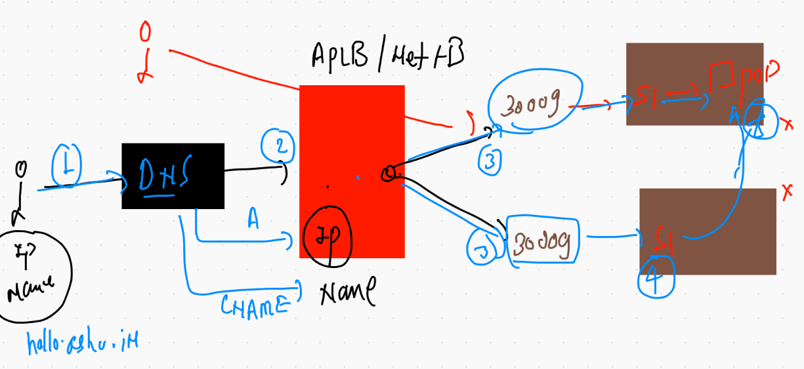

# Docker & k8s certifications 


## Updating context in k8s client side

```
❯ kubectl  config  get-contexts
CURRENT   NAME                          CLUSTER      AUTHINFO           NAMESPACE
          kubernetes-admin@kubernetes   kubernetes   kubernetes-admin   
*         minikube                      minikube     minikube           default
❯ minikube stop
✋  Stopping node "minikube"  ...
🛑  Powering off "minikube" via SSH ...
🛑  1 nodes stopped.
❯ cp -f Desktop/admin.conf  ~/.kube/config
❯ minikube start
😄  minikube v1.20.0 on Darwin 11.2.3
✨  Using the docker driver based on existing profile
👍  Starting control plane node minikube in cluster minikube
🚜  Pulling base image ...
🔄  Restarting existing docker container for "minikube" ...
🐳  Preparing Kubernetes v1.20.2 on Docker 20.10.6 ...
🔎  Verifying Kubernetes components...
    ▪ Using image gcr.io/k8s-minikube/storage-provisioner:v5
🌟  Enabled addons: storage-provisioner, default-storageclass
🏄  Done! kubectl is now configured to use "minikube" cluster and "default" namespace by default
❯ kubectl  config  get-contexts
CURRENT   NAME                          CLUSTER      AUTHINFO           NAMESPACE
          kubernetes-admin@kubernetes   kubernetes   kubernetes-admin   
*         minikube                      minikube     minikube           default


```

## How to switch context in k8s

```
❯ kubectl  config get-contexts
CURRENT   NAME                          CLUSTER      AUTHINFO           NAMESPACE
          kubernetes-admin@kubernetes   kubernetes   kubernetes-admin   
*         minikube                      minikube     minikube           default
❯ 
❯ kubectl   get  nodes
NAME       STATUS   ROLES                  AGE   VERSION
minikube   Ready    control-plane,master   16h   v1.20.2
❯ 
❯ kubectl  config   use-context   kubernetes-admin@kubernetes
Switched to context "kubernetes-admin@kubernetes".
❯ kubectl  config get-contexts
CURRENT   NAME                          CLUSTER      AUTHINFO           NAMESPACE
*         kubernetes-admin@kubernetes   kubernetes   kubernetes-admin   
          minikube                      minikube     minikube           default
❯ kubectl   get  nodes
NAME          STATUS   ROLES                  AGE   VERSION
master-node   Ready    control-plane,master   20h   v1.21.1
minion1       Ready    <none>                 20h   v1.21.1
minion2       Ready    <none>                 20h   v1.21.1

```

### Deleting pods 

```
❯ kubectl  delete pods  jazzpod-1
pod "jazzpod-1" deleted
❯ kubectl  delete pods  --all
pod "mahi-1" deleted
pod "mypod1" deleted
pod "sandip-1" deleted
pod "srini-1" deleted
pod "yogipod" deleted

```

## Creating sample webapp with nginx web container 


### creating dockerfile 


### building image

```
 docker  build  -t   dockerashu/ashunginx:v1 -f nginx.dockerfile   .
Sending build context to Docker daemon   42.5kB
Step 1/5 : FROM nginx
 ---> f0b8a9a54136
Step 2/5 : MAINTAINER  ashutoshh@linux.com
 ---> Running in 63282f9b5660
Removing intermediate container 63282f9b5660
 ---> 7e24c4011d5d
Step 3/5 : COPY  ashu.html  /usr/share/nginx/html/index.html
 ---> a80ef4c4e5c4
Step 4/5 : ADD  oke.jpeg  /usr/share/nginx/html/oke.jpeg
 ---> 587d48d24905
Step 5/5 : EXPOSE 80
 ---> Running in 520bfc2382b4
Removing intermediate container 520bfc2382b4
 ---> 3a18844d6b99
Successfully built 3a18844d6b99
Successfully tagged dockerashu/ashunginx:v1

```

### push image 

```
 docker push dockerashu/ashunginx:v1
The push refers to repository [docker.io/dockerashu/ashunginx]
db0e400b51b9: Pushed 
1ada9d18f412: Pushed 
f0f30197ccf9: Mounted from dockerabhinav47/abhinav 
eeb14ff930d4: Mounted from dockerabhinav47/abhinav 
c9732df61184: Mounted from dockerabhinav47/abhinav 
4b8db2d7f35a: Mounted from dockerabhinav47/abhinav 
431f409d4c5a: Mounted from dockerabhinav47/abhinav 
02c055ef67f5: Mounted from dockerabhinav47/abhinav 
v1: digest: sha256:a47c831e60b06b14a81d80552134c81245ef2e7f86920a0bf00f8daa4bb4f777 size: 1986

```

### automatically  generating yaml / json for pod

```
10049  kubectl  run   ashupod111  --image=dockerashu/ashunginx:v1 --port 80  --dry-run=client 
10050  kubectl  run   ashupod111  --image=dockerashu/ashunginx:v1 --port 80  --dry-run=client -o yaml
10051  kubectl  run   ashupod111  --image=dockerashu/ashunginx:v1 --port 80  --dry-run=client -o json 

```

### saving file yaml and deploying to k8s cluster 

```
❯ kubectl  run   ashupod111  --image=dockerashu/ashunginx:v1 --port 80  --dry-run=client -o yaml   >nginxpod.yaml
❯ ls
nginxpod.yaml
❯ ls
nginxpod.yaml
❯ kubectl apply -f  nginxpod.yaml
pod/ashupod111 created
❯ kubectl  get   po
NAME          READY   STATUS    RESTARTS   AGE
abhinavpod2   1/1     Running   0          12s
ashupod111    1/1     Running   0          6s
❯ kubectl  get   po  -o wide
NAME          READY   STATUS    RESTARTS   AGE   IP              NODE      NOMINATED NODE   READINESS GATES
abhinavpod2   1/1     Running   0          16s   192.168.34.12   minion1   <none>           <none>
ashupod111    1/1     Running   0          10s   192.168.34.13   minion1   <none>           <none>

```

## Networking with service concept in k8s


### type of services 


### understanding svc to pod connection 


### understanding label concept


## Nodeport service 


## checking label 

```
❯ kubectl  get   po  ashupod111  --show-labels
NAME         READY   STATUS    RESTARTS   AGE   LABELS
ashupod111   1/1     Running   0          88m   x=helloashu
❯ kubectl  get   po    --show-labels
NAME               READY   STATUS    RESTARTS   AGE   LABELS
abhinavpod2        1/1     Running   0          88m   run=abhinavpod2
ashupod111         1/1     Running   0          88m   x=helloashu
dhirajnginxpod1    1/1     Running   0          79m   run=dhirajnginxpod1
dipspod11          1/1     Running   0          82m   run=dipspod11
jazzpod1           1/1     Running   0          88m   run=jazzpod1
mahiwebpod-1       1/1     Running   0          81m   run=mahiwebpod-1
naveenlistingpod   1/1     Running   0          82m   run=naveenlistingpod
naveenpod1         1/1     Running   0          87m   run=naveenpod1
ramanpod1          1/1     Running   0          87m   run=ramanpod1
revathipod1        1/1     Running   0          80m   run=revathipod1
sandip111          1/1     Running   0          88m   run=sandip111
srinipod111        1/1     Running   0          72m   run=srinipod111
swatingnixpod1     1/1     Running   0          88m   true=helloswati17
venkat123          1/1     Running   0          76m   run=venkat123
yogipod1           1/1     Running   0          82m   run=yogipod1

```

### creating nodeport service 

```
❯ kubectl   create   service  nodeport  ashusvc1  --tcp 1234:80  --dry-run=client -o yaml
apiVersion: v1
kind: Service
metadata:
  creationTimestamp: null
  labels:
    app: ashusvc1
  name: ashusvc1
spec:
  ports:
  - name: 1234-80
    port: 1234
    protocol: TCP
    targetPort: 80
  selector:
    app: ashusvc1
  type: NodePort
status:
  loadBalancer: {}
❯ kubectl   create   service  nodeport  ashusvc1  --tcp 1234:80  --dry-run=client -o yaml   >nginx_svc1.yml


```


### nodeport done


## for better practise 


### svc and pod history 

```
  kubectl   create   service  nodeport  ashusvc1  --tcp 1234:80  --dry-run=client -o yaml  
10080  kubectl   create   service  nodeport  ashusvc1  --tcp 1234:80  --dry-run=client -o yaml   >nginx_svc1.yml
10081  ls
10082  kubectl  apply -f  nginx_svc1.yml
10083  kubectl   get   service  
10084  history
10085  kubectl   get   service  
10086  kubectl   get   svc
10087  kubectl  get  po 
10088  kubectl  exec -it  jazzpod1  -- bash 
10089  history
10090  kubectl  get  no
10091  kubectl  get  po
10092  kubectl  get  svc
10093  kubectl  get  po 
10094  kubectl  get  po ashupod111  --show-labels
10095  kubectl  get  svc
10096  kubectl  get  svc  ashusvc1 
10097  kubectl  get  svc  ashusvc1 -o wide
10098  history
10099  kubectl  get  po ashupod111  --show-labels
10100  kubectl  get  svc  ashusvc1 -o wide
10101  history
10102  kubectl  apply -f  nginx_svc1.yml
10103  kubectl  get  po ashupod111  --show-labels
10104  kubectl  get  svc  ashusvc1 -o wide
10105  kubectl  apply -f  nginx_svc1.yml
10106  kubectl  get  svc  ashusvc1 -o wide

```

### external loadbalancer concept 



# Introduction to RC 


## RC file understanding 


## Deploying RC 

```
❯ kubectl  apply -f  ashu-rc.yml
replicationcontroller/ashurc-1 created
❯ 
❯ kubectl  get  replicationcontroller
NAME         DESIRED   CURRENT   READY   AGE
ashurc-1     1         1         1       10s
dhirajrc-1   1         1         1       8s
dipsrc-1     1         1         0       1s
swatirc-1    1         1         1       32s
venkat-rc1   1         1         1       10s

```

## to automatch label of pod -- create service using expose 

```
❯ kubectl   expose   rc  ashurc-1   --type NodePort --port 1234 --target-port 80 --name ashusvc2
service/ashusvc2 exposed
❯ kubectl  get  svc
NAME         TYPE        CLUSTER-IP       EXTERNAL-IP   PORT(S)          AGE
ashusvc2     NodePort    10.109.211.167   <none>        1234:31604/TCP   20s

```

### appending in the same file where rc was there 

```
kubectl   expose   rc  ashurc-1   --type NodePort --port 1234 --target-port 80 --name ashusvc2  --dry-run=client -o yaml  
10022  kubectl   expose   rc  ashurc-1   --type NodePort --port 1234 --target-port 80 --name ashusvc2  --dry-run=client -o yaml    >>ashu-rc.yml 

```

### scaling of pod by changing into RC file 

```
❯ kubectl apply -f ashu-rc.yml
replicationcontroller/ashurc-1 configured
service/ashusvc2 created
❯ kubectl  get  rc
NAME         DESIRED   CURRENT   READY   AGE
abhirc-1     1         1         1       26m
ashurc-1     2         2         2       27m

```

## checking rc and svc


## scaling up and down without YAML file 

```
venkat-rc1   2         2         2       31m
❯ kubectl  scale  rc   ashurc-1   --replicas=5
replicationcontroller/ashurc-1 scaled
❯ kubectl  get  rc   ashurc-1
NAME       DESIRED   CURRENT   READY   AGE
ashurc-1   5         5         5       31m
❯ kubectl  scale  rc   ashurc-1   --replicas=1
replicationcontroller/ashurc-1 scaled
❯ kubectl  get  rc   ashurc-1
NAME       DESIRED   CURRENT   READY   AGE
ashurc-1   1         1         1       31m

```

### Multi stage dockerfile with tomcat example 

```
# stage 1 just for build java project into .war file s
FROM oraclelinux:8.3  as Builder  
MAINTAINER ashutoshh@linux.com
RUN dnf install java-1.8.0-openjdk.x86_64 -y
# JDK installing 
RUN dnf  install maven -y
# maven in an build automation tool for java project
RUN mkdir  /myjavawebapp
WORKDIR  /myjavawebapp 
# to change directory during image build time permanently
COPY  .  . 
# first . all source data  
RUN mvn clean package 
# for automated building of java project 
# as an output we get .war file as entire code 

# stage 2 copy .war into tomcat 
FROM tomcat
MAINTAINER ashutoshh@.linux.com , 9509957594
RUN mkdir  /webcode 
COPY --from=Builder  /myjavawebapp   /webcode
RUN cp -rf  /webcode/target/WebApp.war  /usr/local/tomcat/webapps/
RUN  rm -rf /webcode/* 
EXPOSE 8080
# from above stage we are only copying data 
# /myjavawbeapp  to  /webcode in new image 

```


### building image 

```
 docker build  -t  dockerashu/jsp:v1122  .
 
```

```
 docker  login 
10061  docker push dockerashu/jsp:v1122
10062  docker logout 

```

## pushing image to ACR 

```
docker  tag  alpine:latest   docker.io/dockerashu/alpine:v1
❯ 
❯ docker  tag  alpine:latest   ashuoracle.azurecr.io/alpine:v1
❯ docker  login   ashuoracle.azurecr.io
Username: ashuoracle
Password: 
Login Succeeded
❯ docker  push  ashuoracle.azurecr.io/alpine:v1
The push refers to repository [ashuoracle.azurecr.io/alpine]
b2d5eeeaba3a: Pushed 
v1: digest: sha256:def822f9851ca422481ec6fee59a9966f12b351c62ccb9aca841526ffaa9f748 size: 528
❯ docker  logout   ashuoracle.azurecr.io
Removing login credentials for ashuoracle.azurecr.io

```

## Deploying private registy image into K8s need --- Secret 

## secret 


### creating secret 

```
kubectl  create  secret  docker-registry   azuresec  --docker-server=ashuoracle.azurecr.io  --docker-username=ashuoracle  --docker-password=UklRac5f2tj7=N4QvEWYSHD
secret/azuresec created

```

### showing secret 

```
❯ kubectl  get  secret
NAME                  TYPE                                  DATA   AGE
azuresec              kubernetes.io/dockerconfigjson        1      33s
default-token-t52mp   kubernetes.io/service-account-token   3      27h

```

### app deloy 

```
❯ kubectl  apply -f  alp.yml
pod/ashupodalp created
❯ kubectl  get   po
NAME                   READY   STATUS             RESTARTS   AGE
abhipodalp             1/1     Running            0          20s
abhirc-1-lj4n2         1/1     Running            0          33m
abhirc-1-rblvq         1/1     Running            0          33m
ashupodalp             1/1     Running            0          5s
ashurc-1-hcczx         1/1     Running            0          34m
dhirajtomcatrc-74vng   1/1     Running            0          31m
dhirajtomcatrc-t62t5   1/1     Running            0          31m
dipsrc-1-m2cfn         1/1     Running            0          33m
mahipodalp             0/1     ImagePullBackOff   0          10m
myyogiapp-gj8xq        0/1     ImagePullBackOff   0          13m
naveenrc-1-2799w       1/1     Running            0          33m
ramanpodalp            1/1     Running            0          11m
sandip-1-94cdc         1/1     Running            0          31m
swatipodalp            1/1     Running            0          15m
swatirc-1-csknx        1/1     Running            0          33m
❯ kubectl  logs  -f  ashupodalp
PING fb.com (157.240.229.35): 56 data bytes
64 bytes from 157.240.229.35: seq=0 ttl=51 time=0.564 ms
64 bytes from 157.240.229.35: seq=1 ttl=51 time=0.596 ms
64 bytes from 157.240.229.35: seq=2 ttl=51 time=0.655 ms
64 bytes from 157.240.229.35: seq=3 ttl=51 time=2.943 ms
64 bytes from 157.240.229.35: seq=4 ttl=51 time=0.594 ms
64 bytes from 157.240.229.35: seq=5 ttl=51 time=0.641 ms
64 bytes from 157.240.229.35: seq=6 ttl=51 time=0.588 ms

```


