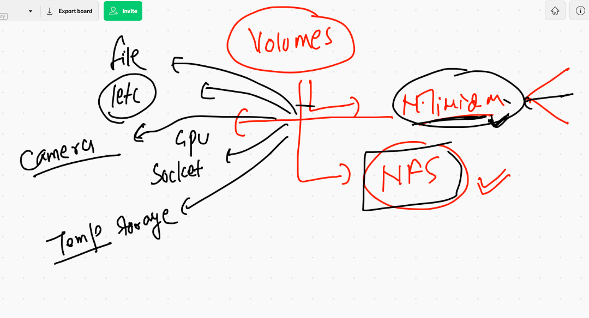
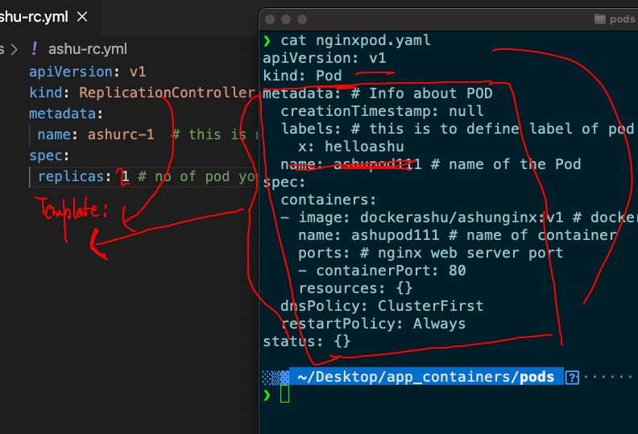
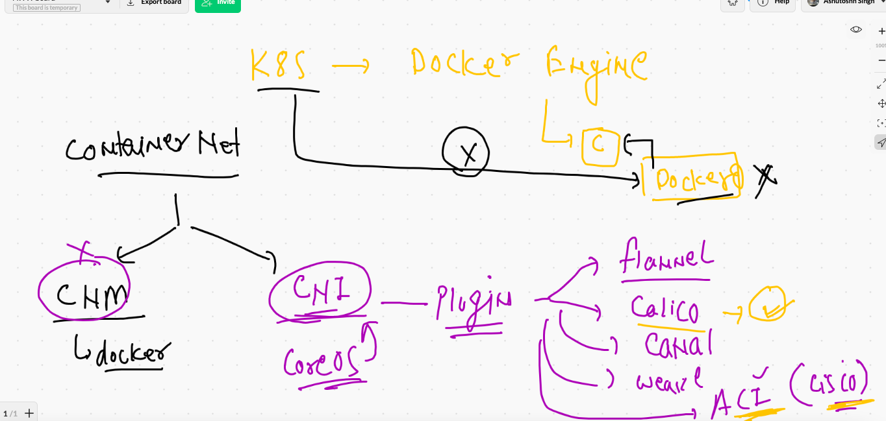

# docker tips

## On docker host 

### non root user can't use docker cli so to do that 

```
 usermod -aG docker  ec2-user
```

### here ec2-user is a non root user 

# VOlume 



## creating volume 

```
❯ docker  volume  ls
DRIVER    VOLUME NAME
❯ docker  volume  create  ashuvol1
ashuvol1
❯ docker  volume  ls
DRIVER    VOLUME NAME
local     ashuvol1
❯ docker  volume  inspect  ashuvol1
[
    {
        "CreatedAt": "2021-05-19T04:38:24Z",
        "Driver": "local",
        "Labels": {},
        "Mountpoint": "/var/lib/docker/volumes/ashuvol1/_data",
        "Name": "ashuvol1",
        "Options": {},
        "Scope": "local"
    }
]

```

## Mounting a particular directory into container 

```
 docker  run   -it --rm  -v  /etc:/myhostetc:ro   ubuntu   bash
Unable to find image 'ubuntu:latest' locally
latest: Pulling from library/ubuntu
345e3491a907: Pull complete 
57671312ef6f: Pull complete 
5e9250ddb7d0: Pull complete 
Digest: sha256:cf31af331f38d1d7158470e095b132acd126a7180a54f263d386da88eb681d93
Status: Downloaded newer image for ubuntu:latest
root@a673c5f1c70a:/# 
root@a673c5f1c70a:/# 
root@a673c5f1c70a:/# cat  /etc/os-release 
NAME="Ubuntu"
VERSION="20.04.2 LTS (Focal Fossa)"
ID=ubuntu
ID_LIKE=debian
PRETTY_NAME="Ubuntu 20.04.2 LTS"
VERSION_ID="20.04"
HOME_URL="https://www.ubuntu.com/"
SUPPORT_URL="https://help.ubuntu.com/"
BUG_REPORT_URL="https://bugs.launchpad.net/ubuntu/"
PRIVACY_POLICY_URL="https://www.ubuntu.com/legal/terms-and-policies/privacy-policy"
VERSION_CODENAME=focal
UBUNTU_CODENAME=focal
root@a673c5f1c70a:/# ls
bin   dev  home  lib32  libx32  mnt        opt   root  sbin  sys  usr
boot  etc  lib   lib64  media   myhostetc  proc  run   srv   tmp  var
root@a673c5f1c70a:/# cd  myhostetc/
root@a673c5f1c70a:/myhostetc# ls
DIR_COLORS               cron.monthly         hibinit-config.cfg  mke2fs.conf        protocols         shells
DIR_COLORS.256color      cron.weekly          host.conf           modprobe.d         python            skel
DIR_COLORS.lightbgcolor  crontab              hostname            modules-load.d     rc.d              ssh
GREP_COLORS              csh.cshrc            hosts               motd               rc.local          ssl
GeoIP.conf               csh.login            hosts.allow         mtab               rc0.d             statetab
GeoIP.conf.default       dbus-1               hosts.deny          my.cnf             rc1.d             statetab.d
NetworkManager           default              idmapd.conf         my.cnf.d           rc2.d             subgid
X11                      depmod.d             image-id            nanorc             rc3.d             subuid
acpi                     dhcp                 init.d              netconfig          rc4.d             sudo-ldap.conf
adjtime                  docker               inittab             networks           rc5.d             sudo.conf
aliases                  docker-runtimes.d    inputrc             nfs.conf           rc6.d             sudoers
aliases.db               dracut.conf          iproute2            nfsmount.conf      request-key.conf  sudoers.d
alternatives             dracut.conf.d        issu

```

### 

```
❯ docker  run   -it --rm  -v  /etc:/myhostetc:ro  -v  ashuvol1:/okvol:rw   ubuntu   bash
root@b0f55516d588:/# ls
bin   dev  home  lib32  libx32  mnt        okvol  proc  run   srv  tmp  var
boot  etc  lib   lib64  media   myhostetc  opt    root  sbin  sys  usr
```


### more examples 

```
5  docker  run   -it --rm  -v  /etc:/myhostetc:ro   ubuntu   bash 
10016  history
10017  docker  run   -it --rm  -v  /etc:/myhostetc:ro  -v  ashuvol1:/okvol:rw   ubuntu   bash 
10018  history
10019  docker  run -itd --name any  -p 9000:9000  -v  /var/run/docker.sock:/var/run/docker.sock  portainer/portainer

```

## App deployment issues with containers


# Orchestration engine 


## K8s arch 1 


## Minion understanding 


## Kube-apiserver


## kube-schedular 


### kube-controller-manager reality 


### Node-controller 


### Replication-controller 



### etcd the brain of k8s


### CNI 



### CNI bridge on minion side


### kube-proxy -- to maintain communication b/w container across minion node


### k8s drops docker support. -- reality 


# K8s setup 

## methods 


### kubectl installation on Mac as k8s client software 

```
  curl -LO "https://dl.k8s.io/release/$(curl -L -s https://dl.k8s.io/release/stable.txt)/bin/darwin/amd64/kubectl"

  % Total    % Received % Xferd  Average Speed   Time    Time     Time  Current
                                 Dload  Upload   Total   Spent    Left  Speed
100   154  100   154    0     0    437      0 --:--:-- --:--:-- --:--:--   437
100 53.2M  100 53.2M    0     0  9969k      0  0:00:05  0:00:05 --:--:-- 12.4M
❯ chmod +x ./kubectl
❯ sudo mv ./kubectl /usr/local/bin/kubectl
Password:
❯ sudo chown root: /usr/local/bin/kubectl
❯ kubectl version --client
Client Version: version.Info{Major:"1", Minor:"21", GitVersion:"v1.21.1", GitCommit:"5e58841cce77d4bc13713ad2b91fa0d961e69192", GitTreeState:"clean", BuildDate:"2021-05-12T14:18:45Z", GoVersion:"go1.16.4", Compiler:"gc", Platform:"darwin/amd64"}

```

### SSL token on master node


### checking cluster / master node / control plane  connection 

```
 kubectl   cluster-info   --kubeconfig=admin.conf
Kubernetes control plane is running at https://52.20.84.60:6443
CoreDNS is running at https://52.20.84.60:6443/api/v1/namespaces/kube-system/services/kube-dns:dns/proxy

To further debug and diagnose cluster problems, use 'kubectl cluster-info dump'.

```


### antoher way 

```
❯ kubectl  get  nodes    --kubeconfig=admin.conf
NAME          STATUS   ROLES                  AGE   VERSION
master-node   Ready    control-plane,master   68m   v1.21.1
minion1       Ready    <none>                 67m   v1.21.1
minion2       Ready    <none>                 67m   v1.21.1

```

### configure admin.conf permentaly 


###

```
❯ cp  -v  admin.conf  ~/.kube/config
admin.conf -> /Users/fire/.kube/config
❯ kubectl   get   nodes
NAME          STATUS   ROLES                  AGE   VERSION
master-node   Ready    control-plane,master   81m   v1.21.1
minion1       Ready    <none>                 80m   v1.21.1
minion2       Ready    <none>                 80m   v1.21.1

```

### build |. release |. deploy 


## Introduction to POD 


### POd in more details 


### First Pod 


### dry-run 

```
❯ kubectl  apply   -f  ashupod1.yaml  --dry-run=client
pod/ashupod-1 created (dry run)

```

### Deploy pod 

```
❯ kubectl  apply   -f  ashupod1.yaml
pod/ashupod-1 created
❯ kubectl  get   pods
NAME         READY   STATUS              RESTARTS   AGE
ashupod-1    0/1     ContainerCreating   0          7s
swatipod-1   0/1     ContainerCreating   0          2s
yogipod      1/1     Running             0          3m22s
❯ kubectl  get   pods
NAME          READY   STATUS              RESTARTS   AGE
abhipod-1     1/1     Running             0          8s
ashupod-1     1/1     Running             0          21s

```

### more info about pod 

```
❯ kubectl  get   pod  ashupod-1   -o wide
NAME        READY   STATUS    RESTARTS   AGE     IP                NODE      NOMINATED NODE   READINESS GATES
ashupod-1   1/1     Running   0          7m38s   192.168.179.195   minion2   <none>           <none>

```

###

```
❯ kubectl  get   pod   -o wide
NAME          READY   STATUS         RESTARTS   AGE     IP                NODE      NOMINATED NODE   READINESS GATES
abhipod-1     1/1     Running        0          8m13s   192.168.179.198   minion2   <none>           <none>
ashupod-1     1/1     Running        0          8m26s   192.168.179.195   minion2   <none>           <none>
dhirajpod-1   1/1     Running        0          8m17s   192.168.179.197   minion2   <none>           <none>
dipspod-1     1/1     Running        0          4m47s   192.168.34.5      minion1   <none>           <none>
jazzpod-1     1/1     Running        0          7m14s   192.168.34.4      minion1   <none>           <none>
mahi-1        1/1     Running        0          8m11s   192.168.179.199   minion2   <none>           <none>
mypod1        1/1     Running        0          6m4s    192.168.179.201   minion2   <none>           <none>
naveenpod-1   1/1     Running        0          4m41s   192.168.34.6      minion1   <none>           <none>
ramanpod-1    1/1     Running        0          7m54s   192.168.179.200   minion2   <none>           <none>
sandip-1      1/1     Running        0          8m10s   192.168.34.3      minion1   <none>           <none>
srini-1       0/1     ErrImagePull   0          61s     192.168.179.203   minion2   <none>           <none>
swatipod-1    1/1     Running        0          8m21s   192.168.179.196   minion2   <none>           <none>
yogipod       1/1     Running        0          11m     192.168.34.2      minion1   <none>           <none>

```


