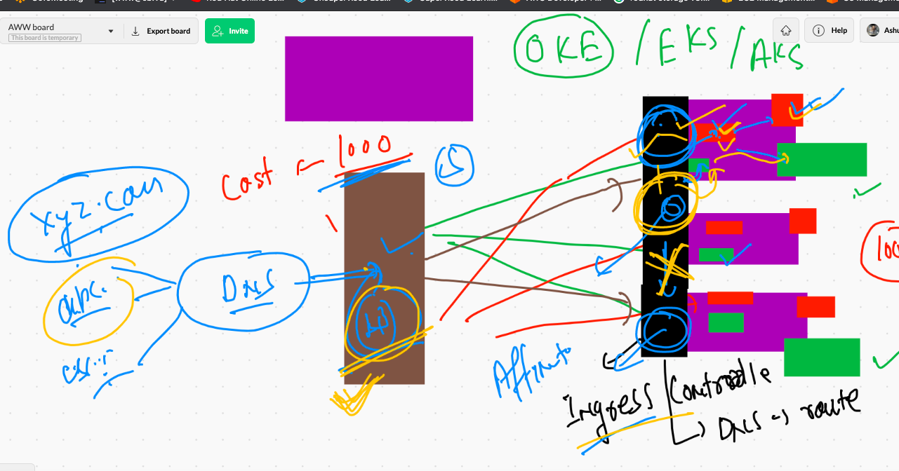

#  k8s revision 


## checking api resources 

```
❯ kubectl  get  all
NAME                       READY   STATUS    RESTARTS   AGE
pod/abhipodalp             1/1     Running   1          16h
pod/abhirc-1-lj4n2         1/1     Running   1          16h
pod/abhirc-1-rblvq         1/1     Running   1          16h
pod/ashupodalp             1/1     Running   1          16h
pod/ashurc-1-hcczx         1/1     Running   1          16h
pod/dhirajalp              1/1     Running   1          16h
pod/dhirajtomcatrc-74vng   1/1     Running   1          16h
pod/dhirajtomcatrc-t62t5   1/1     Running   1          16h
pod/dipsrc-1-m2cfn         1/1     Running   1          16h
pod/jazzpodalpine          1/1     Running   1          16h
pod/mahipodalp             1/1     Running   1          16h
pod/myyogiapp-gj8xq        1/1     Running   1          16h
pod/naveenrc-1-2799w       1/1     Running   1          16h
pod/nvnpodalp              1/1     Running   3          16h
pod/ramanpodalp            1/1     Running   1          16h
pod/sandip-1-94cdc         1/1     Running   1          16h
pod/swatipodalp            1/1     Running   1          16h
pod/swatirc-1-csknx        1/1     Running   1          16h

NAME                                   DESIRED   CURRENT   READY   AGE
replicationcontroller/abhirc-1         2         2         2       16h
replicationcontroller/ashurc-1         1         1         1       16h
replicationcontroller/dhirajtomcatrc   2         2         2       16h
replicationcontroller/dipsrc-1         1         1         1       16h
replicationcontroller/myyogiapp        1         1         1       16h
replicationcontroller/naveenrc-1       1         1         1       16h
replicationcontroller/sandip-1         1         1         1       16h
replicationcontroller/swatirc-1        1         1         1       16h

NAME                 TYPE        CLUSTER-IP       EXTERNAL-IP   PORT(S)          AGE
service/abhisvc1     NodePort    10.97.63.182     <none>        2345:32710/TCP   16h
service/ashusvc2     NodePort    10.107.184.111   <none>        1234:31452/TCP   16h
service/dhirajsvc1   NodePort    10.96.66.205    

```


# Namespaces 


## understanding default namespaces 


### creating namespaces

```
❯ kubectl  create  namespace   ashuspace  --dry-run=client  -o yaml
apiVersion: v1
kind: Namespace
metadata:
  creationTimestamp: null
  name: ashuspace
spec: {}
status: {}
❯ kubectl  create  namespace   ashuspace
namespace/ashuspace created
❯ kubectl   get   ns
NAME              STATUS   AGE
ashuspace         Active   3s
default           Active   44h
kube-node-lease   Active   44h
kube-public       Active   44h
kube-system       Active   44h

```

### setting default namesapce 

```
❯ kubectl  config set-context  --current  --namespace=ashuspace
Context "kubernetes-admin@kubernetes" modified.
❯ kubectl  config get-contexts
CURRENT   NAME                          CLUSTER      AUTHINFO           NAMESPACE
*         kubernetes-admin@kubernetes   kubernetes   kubernetes-admin   ashuspace
          minikube                      minikube     minikube           default
❯ kubectl  get  po
No resources found in ashuspace namespace.
❯ kubectl  get  svc
No resources found in ashuspace namespace.
❯ kubectl  get  rc
No resources found in ashuspace namespace.

```

# Deployment of opensource dashboard in k8s cluster

```
❯ kubectl apply -f https://raw.githubusercontent.com/kubernetes/dashboard/v2.2.0/aio/deploy/recommended.yaml
namespace/kubernetes-dashboard created
serviceaccount/kubernetes-dashboard created
service/kubernetes-dashboard created
secret/kubernetes-dashboard-certs created
secret/kubernetes-dashboard-csrf created
secret/kubernetes-dashboard-key-holder created
configmap/kubernetes-dashboard-settings created
role.rbac.authorization.k8s.io/kubernetes-dashboard created
clusterrole.rbac.authorization.k8s.io/kubernetes-dashboard created
rolebinding.rbac.authorization.k8s.io/kubernetes-dashboard created
clusterrolebinding.rbac.authorization.k8s.io/kubernetes-dashboard created
deployment.apps/kubernetes-dashboard created
service/dashboard-metrics-scraper created
deployment.apps/dashboard-metrics-scraper created

```

## for reading refer URL below 

[k8sdashboard](https://kubernetes.io/docs/tasks/access-application-cluster/web-ui-dashboard/)


### dashboard more details 

```
❯ kubectl   get   po  -n kubernetes-dashboard
NAME                                         READY   STATUS    RESTARTS   AGE
dashboard-metrics-scraper-856586f554-7b8lh   1/1     Running   0          2m6s
kubernetes-dashboard-78c79f97b4-6nzjj        1/1     Running   0          2m8s
❯ kubectl   get   svc   -n kubernetes-dashboard
NAME                        TYPE        CLUSTER-IP       EXTERNAL-IP   PORT(S)    AGE
dashboard-metrics-scraper   ClusterIP   10.102.182.186   <none>        8000/TCP   2m26s
kubernetes-dashboard        ClusterIP   10.98.27.47      <none>        443/TCP    2m34s
❯ kubectl   edit   svc    kubernetes-dashboard    -n kubernetes-dashboard
service/kubernetes-dashboard edited
❯ kubectl   get   svc   -n kubernetes-dashboard
NAME                        TYPE        CLUSTER-IP       EXTERNAL-IP   PORT(S)         AGE
dashboard-metrics-scraper   ClusterIP   10.102.182.186   <none>        8000/TCP        3m54s
kubernetes-dashboard        NodePort    10.98.27.47      <none>        443:31252/TCP   4m2s

```

### getting. token for dashboard login 

```
❯ kubectl   get  secret  -n kubernetes-dashboard
NAME                               TYPE                                  DATA   AGE
default-token-5qt5t                kubernetes.io/service-account-token   3      9m12s
kubernetes-dashboard-certs         Opaque                                0      9m10s
kubernetes-dashboard-csrf          Opaque                                1      9m9s
kubernetes-dashboard-key-holder    Opaque                                2      9m8s
kubernetes-dashboard-token-4vh84   kubernetes.io/service-account-token   3      9m12s
❯ kubectl  describe  secret  kubernetes-dashboard-token-4vh84  -n  kubernetes-dashboard
Name:         kubernetes-dashboard-token-4vh84
Namespace:    kubernetes-dashboard
Labels:       <none>
Annotations:  kubernetes.io/service-account.name: kubernetes-dashboard
              kubernetes.io/service-account.uid: 92266d93-8478-487b-95e8-ee4070c84684

Type:  kubernetes.io/service-account-token

Data
====
ca.crt:     1066 bytes
namespace:  20 bytes
token:      eyJhbGciOiJSUzI1NiIsImtpZCI6IlpDZ3RXcVN0Wk9KUTdwVndRd293SjlQVE1jZTlSMldDV2swams3aDZPMnMifQ.eyJpc3MiOiJrdWJlcm5ldGVzL3NlcnZpY2VhY2NvdW50Iiwia3ViZXJuZXRlcy5pby9zZXJ2aWNlYWNjb3VudC9uYW1lc3BhY2UiOiJrdWJlcm5ldGVzLWRhc2hib2FyZCIsImt1YmVybmV0ZXMuaW8vc2VydmljZWFjY291bnQvc2VjcmV0Lm5hbWUiOiJrdWJlcm5ldGVzLWRhc2

```

## users in k8s


## everyname space has default serviceaccount 

```
❯ kubectl   get  sa
NAME      SECRETS   AGE
default   1         38m
❯ 

```

### chekcing service account and secret of k8s dashboard 


## roles and rolebindings 

### checking clusterrole 

```
❯ kubectl  get  clusterroles
NAME                                                                   CREATED AT
admin                                                                  2021-05-19T08:12:59Z
calico-kube-controllers                                                2021-05-19T08:14:13Z
calico-node                                                            2021-05-19T08:14:13Z
cluster-admin                                                          2021-05-19T08:12:59Z
edit                                                                   2021-05-19T08:12:59Z
kubeadm:get-nodes                                                      2021-05-19T08:13:00Z
kubernetes-dashboard                                                   2021-05-21T05:03:26Z
system:aggregate-to-admin                                              2021-05-19T08:12:59Z
system:aggregate-to-edit                                               2021-05-19T08:12:59Z
system:aggregate-to-view                                               2021-05-19T08:12:59Z
system:auth-delegator                                                  2021-05-19T08:12:59Z
system:basic-user                                                      2021-05-19T08:12:59Z
system:certificates.k8s.io:certificatesigningrequests:nodeclient       2021-05-19T08:12:59Z
system:certificates.k8s.io:certificatesigningrequests:selfnodeclient   2021-05-19T08:12:59Z
system:certificates.k8s.io:kube-apiserver-client-approver              2021-05-19T08:12:59Z
system:certificates.k8s.io:kube-apiserver-client-kubelet-approver      2021-05-19T08:12:59Z
system:certificates.k8s.io:kubelet-serving-approver                    2021-05-19T08:12:59Z
system:certificates.k8s.io:legacy-unknown-approver                     2021-05-19T08:12:59Z
system:controller:attachdetach-controller

```

# Deployment 

## deployment understanding 


### reality of deployent 


### creating deployment using yaml 

```
❯ kubectl  create  deployment  ashuwebapp  --image=dockerashu/ashunginx:v1  --dry-run=client -o yaml
apiVersion: apps/v1
kind: Deployment
metadata:
  creationTimestamp: null
  labels:
    app: ashuwebapp
  name: ashuwebapp
spec:
  replicas: 1
  selector:
    matchLabels:
      app: ashuwebapp
  strategy: {}
  template:
    metadata:
      creationTimestamp: null
      labels:
        app: ashuwebapp
    spec:
      containers:
      - image: dockerashu/ashunginx:v1
        name: ashunginx
        resources: {}

```

### 

```
 kubectl  create  deployment  ashuwebapp  --image=dockerashu/ashunginx:v1  --dry-run=client -o yaml   >ashudep.yml
 
```
### creating loadbalancer type service 

```
kubectl   create  service  loadbalancer  ashusvc1  --tcp  1234:80  --dry-run=client -o yaml
apiVersion: v1
kind: Service
metadata:
  creationTimestamp: null
  labels:
    app: ashusvc1
  name: ashusvc1
spec:
  ports:
  - name: 1234-80
    port: 1234
    protocol: TCP
    targetPort: 80
  selector:
    app: ashusvc1
  type: LoadBalancer
status:
  loadBalancer: {}
  
```

### Deployment 

```
 kubectl  apply  -f  ashudep.yml
deployment.apps/ashuwebapp created
Warning: resource services/ashusvc1 is missing the kubectl.kubernetes.io/last-applied-configuration annotation which is required by kubectl apply. kubectl apply should only be used on resources created declaratively by either kubectl create --save-config or kubectl apply. The missing annotation will be patched automatically.
service/ashusvc1 configured
❯ kubectl   get  deployment
NAME         READY   UP-TO-DATE   AVAILABLE   AGE
ashuwebapp   1/1     1            1           9s
❯ kubectl   get  deploy
NAME         READY   UP-TO-DATE   AVAILABLE   AGE
ashuwebapp   1/1     1            1           13s
❯ kubectl  get  svc
NAME       TYPE           CLUSTER-IP      EXTERNAL-IP   PORT(S)          AGE
ashusvc1   LoadBalancer   10.104.49.138   <pending>     1234:32261/TCP   55m

```

### scaling pod 

```
❯ kubectl  scale deployment  ashuwebapp  --replicas=3
deployment.apps/ashuwebapp scaled
❯ 
❯ kubectl  get deploy
NAME         READY   UP-TO-DATE   AVAILABLE   AGE
ashuwebapp   3/3     3            3           105s
❯ kubectl   get   rs
NAME                    DESIRED   CURRENT   READY   AGE
ashuwebapp-7558d54776   3         3         3       108s
❯ kubectl   get  po
NAME                          READY   STATUS    RESTARTS   AGE
ashupod111                    1/1     Running   0          110m
ashuwebapp-7558d54776-l9th2   1/1     Running   0          112s
ashuwebapp-7558d54776-lp5gm   1/1     Running   0          11s
ashuwebapp-7558d54776-ncj6l   1/1     Running   0          11s

```

## more commands to deployment 

```
10200  kubectl  apply -f  ashudep.yml
10201  kubectl  get po
10202  kubectl  describe deploy  ashuwebapp
10203  history
10204  kubectl  rollout undo  deployment  ashuwebapp  
10205  kubectl  get  po 
10206  kubectl  describe deploy  ashuwebapp
10207  kubectl  get  po 
10208  history
10209  kubectl  rollout  history  deployment  ashuwebapp  
10210  history
10211  kubectl  describe deploy  ashuwebapp
10212  history
10213  kubectl  describe deploy  ashuwebapp
10214  kubectl  set  image  deployment  ashuwebapp  ashunginx=dockerashu/ashunginx:v2
10215  kubectl  describe deploy  ashuwebapp
❯ kubectl  rollout  history  deployment  ashuwebapp
deployment.apps/ashuwebapp 
REVISION  CHANGE-CAUSE
3         <none>
4         <none>

```

## Session affinity / session stickyness IDea 



# Storage in K8s


## link 

[volumes](https://kubernetes.io/docs/concepts/storage/volumes/)

## volume in examples


### volume type 


### creating and mounting volume inside POD 


## deploy alpine pod with volume 

```
❯ kubectl  exec  -it  ashuemppod  -- sh
/ # 
/ # 
/ # cd /mnt/oracle/
/mnt/oracle # 
/mnt/oracle # 
/mnt/oracle # ls
time.txt
/mnt/oracle # cat  time.txt 
Fri May 21 09:33:05 UTC 2021
Fri May 21 09:33:10 UTC 2021
Fri May 21 09:33:15 UTC 2021
Fri May 21 09:33:20 UTC 2021
Fri May 21 09:33:25 UTC 2021
Fri May 21 09:33:30 UTC 2021
Fri May 21 09:33:35 UTC 2021

```

## Multi container POD 


### example of mcpod 


### deployment of mc pod 

```
❯ kubectl  apply -f  empvol.yml
The Pod "ashuemppod" is invalid: spec.containers: Forbidden: pod updates may not add or remove containers
❯ kubectl  replace -f  empvol.yml  --force
pod "ashuemppod" deleted
pod/ashuemppod replaced
❯ kubectl  get   po
NAME         READY   STATUS    RESTARTS   AGE
ashuemppod   2/2     Running   0          9s
❯ kubectl  describe  pod  ashuemppod
Name:         ashuemppod
Namespace:    ashuspace
Priority:     0
Node:         minion2/172.31.76.167
Start Time:   Fri, 21 May 2021 15:27:06 +0530
Labels:       run=ashuemppod
Annotations:  cni.projectcalico.org/podIP: 192.168.179.220/32
              cni.projectcalico.org/podIPs: 192.168.179.220/32
Status:       Running
IP:           192.168.179.220
IPs:
  IP:  192.168.179.220
Containers:
  ashuc1:
    Container ID:   docker://596c5430c0cc1fed55924deb41d05290913879d1a83017bc0b2b46925f9f7a34
    Image:          nginx
    Image ID:       docker-pullable://nginx@sha256:df13abe416e37eb3db4722840dd479b00ba193ac6606e7902331dcea50f4f1f2
    Port:           <none>
    Host Port:      <none>
    State:          Running
      Started:      Fri, 21 May 2021 15:27:07 +0530
    Ready:          True
    Restart Count:  0
    Environment:    <none>
    Mounts:
      /usr/share/nginx/html/ from ashuvol1 (ro)
      /var/run/secrets/kubernetes.io/serviceaccount from kube-api-access-9nf8s (ro)
  ashuemppod:
    Container ID:  docker://4edaef71ca2640688ead0da46f63cefc8e4b5389fcdb66d9fcce2c0bde6c179d
    Image:         alpine
    Image ID:      docker-pullable://ashuoracle.azurecr.io/alpine@sha256:def822f9851ca422481ec6fee59a9966f12b351c62ccb9aca841526ffaa9f748
    Port:          <none>
    Host Port:     <none>
    Command:
      /bin/sh
      -c
      while true;do date >>/mnt/oracle
      
      
```


### creating service 

```
❯ kubectl get  po
NAME         READY   STATUS    RESTARTS   AGE
ashuemppod   2/2     Running   0          2m28s
❯ kubectl  expose pod  ashuemppod  --type NodePort --port 1233 --target-port 80 --name x1
service/x1 exposed
❯ kubectl  get  svc
NAME   TYPE       CLUSTER-IP      EXTERNAL-IP   PORT(S)          AGE
x1     NodePort   10.103.197.41   <none>        1233:31215/TCP   5s

```

### access container 

```
❯ kubectl  exec  -it  ashuemppod  -c ashuc1    -- bash
root@ashuemppod:/# 
root@ashuemppod:/# 
root@ashuemppod:/# cd /usr/share/nginx/
root@ashuemppod:/usr/share/nginx# cd html/
root@ashuemppod:/usr/share/nginx/html# ls
time.txt
root@ashuemppod:/usr/share/nginx/html# exit
exit
❯ 
❯ kubectl  exec  -it  ashuemppod  -c ashuemppod   -- sh
/ # 
/ # 
/ # cd /mnt/oracle/
/mnt/oracle # ls
time.txt
/mnt/oracle # exit

```


